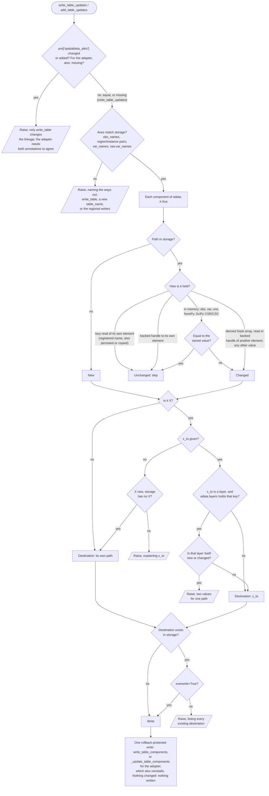

# Downstream analysis with scanpy and rapids-singlecell

Date: 2026-09-30

## Summary

This document evaluates whether Harpy's new table I/O (`hp.tb.read_table`,
`hp.tb.read_table_components`, `hp.tb.write_table`,
`hp.tb.write_table_components`, `hp.tb.delete_table_components`) makes it easier
to run scanpy and rapids-singlecell on large tables stored in SpatialData Zarr
stores, using lazy (Dask) matrices instead of loading tables into memory.

The answer is mostly yes:

- `sd.read_zarr` loads table matrices into memory. For a SpatialData store,
  `hp.tb.read_table(..., mode="lazy")` is therefore the practical way to obtain a
  lazy table without assembling one from AnnData's low-level readers.
- For CSR-stored matrices, the lazy layout that Harpy produces is exactly what
  scanpy and rapids-singlecell require: Dask arrays chunked along rows only, with
  every chunk spanning all features, and `scipy.sparse.csr_matrix` blocks.
- A standard scanpy pipeline ran unchanged on a lazily read Harpy table, and its
  results were persisted with `hp.tb.write_table_components` without rewriting
  the stored counts matrix.
- The identity checks in `write_table_components` correctly refuse to write
  results after cells or genes have been filtered. `hp.tb.write_table` handles
  that case, including when the lazy input still reads from the table being
  replaced.

Three Harpy-side changes would remove most of the remaining friction, in this
order:

1. Lazy chunk layouts do not suit the downstream tools. Two stored layouts are
   split along the feature axis, which scanpy's PCA and QC metrics and
   rapids-singlecell's input check reject:
   - dense matrices, because lazy reads keep their on-disk chunks and Harpy's
     writer produces dense chunks that split the feature axis;
   - CSC matrices, because lazy reads chunk them by genes, with all cells in
     every block. Harpy's Visium and Visium HD readers store `X` as CSC.

   In addition, sparse blocks default to a fixed 1000 rows, far fewer than most
   spatial tables need.

2. Writing lazy results splits the work over many Dask computes, and each
   compute redoes the shared upstream work. AnnData's sparse writer computes one
   block at a time, so a graph with a global reduction, such as
   `normalize_total`'s default median, reads the whole source once per block:
   for a table of 1 M cells in 20 blocks, this more than doubled the write time
   (gap 2).
3. There is no helper that persists "what scanpy changed". Callers must know
   where each scanpy function stores its outputs and list those components.

scanpy and rapids-singlecell also have their own limits on lazy input. Those
cannot be fixed in Harpy, but they should be documented next to the recommended
usage pattern.

## Scope and method

The evaluation covered three things:

1. Harpy's table I/O source and the storage contracts in
   `docs/development/storage.md`.
2. Experiments that read synthetic SpatialData stores with Harpy, ran scanpy on
   the lazy tables, wrote the results back with Harpy and reopened them.
3. A source review of scanpy 1.11.1 and of rapids-singlecell at commit `ed56fe5`
   (`main`, 2026-09-30; latest release v0.17.0), including its tutorials
   repository at commit `d24597e`.

rapids-singlecell requires CUDA and could not be run on the test machine. All
statements about it come from its source code, documentation and tutorials.

Evidence labels used below:

- **Verified**: run locally and checked against the equivalent in-memory result
  where applicable.
- **Source**: read from the source or documentation of the stated version, not
  executed.
- **Inferred**: a conclusion from the source that has not been confirmed by
  running it.

Environment for verified results: macOS (Apple silicon), Python 3.13,
scanpy 1.11.1, anndata 0.12.10, dask 2026.7.1, zarr 3.2.1, spatialdata 0.8.0.
dask-ml, TBB and OpenMP were not available.

## What Harpy's table I/O contributes

**Reading.** `hp.tb.read_table(store, table_name=..., mode="lazy")` opens one
table without opening other SpatialData elements.

- Sparse matrices become Dask arrays with `csr_matrix` or `csc_matrix` blocks,
  matching the stored format. The compressed axis is split into
  `sparse_chunk_size` rows (CSR) or columns (CSC), default 1000, and the other
  axis is kept whole.
- Dense matrices become Dask arrays that keep the on-disk Zarr chunks.
- `obs`, `var` and `uns` are always loaded into memory.

`hp.tb.read_table_components` reads selected components, for example only
`("obs",)`, without constructing matrix graphs.

**Writing.** `hp.tb.write_table_components` replaces selected components of an
existing table:

- `obs`, `var`, individual `layers`/`obsm`/`varm`/`obsp`/`varp` entries, and
  whole or nested `uns` entries;
- in memory, lazy or storage-backed values;
- with the observation and feature identities checked against the stored table;
- staged, then published with rollback on handled failures.

Unrequested components, including `X`, are not read or rewritten.
`hp.tb.write_table` replaces a complete table. It is the path for results whose
axes changed, such as filtered cells or genes.

Compared with AnnData's own `read_elem_lazy` and `write_elem`, Harpy adds:

- locating and validating a table inside a SpatialData store;
- a sparse chunking policy that suits downstream Dask consumers;
- identity checks that stop stale results from being attached to the wrong
  observations or features;
- staged publication, rollback and consolidated-metadata handling.

**SpatialData's reader is eager for tables (verified).** After
`sd.read_zarr(path)`, `sdata.tables[name].X` was a `scipy.sparse.csr_matrix`,
whereas the labels in the same store were lazy Dask arrays. Harpy's own reader
differs: `hp.io.read_zarr` reads tables lazily by default (`table_mode="lazy"`).
Harpy's functions that start from `sdata.tables` therefore receive fully loaded
tables after `sd.read_zarr`, but lazy tables after `hp.io.read_zarr`; see gap 5.

## Verified: scanpy on a lazily read Harpy table

Test data: a synthetic SpatialData store with one labels element and an annotated
table of 4000 cells × 600 genes (Poisson counts, 5% non-zero), written with
`SpatialData.write` and read back with `hp.tb.read_table(..., mode="lazy")`.
Lazy `X` had chunks `(1000, 600)` and `csr_matrix` blocks. "Computes" counts
Dask graph evaluations during each step.

| Step                                                 | Result | Computes | Notes                                                                                                                                  |
| ---------------------------------------------------- | ------ | -------- | -------------------------------------------------------------------------------------------------------------------------------------- |
| `pp.calculate_qc_metrics(percent_top=None)`          | OK     | 4        | `obs`/`var` columns are loaded into memory; `X` is untouched. The default `percent_top` needs at least 500 genes, independent of Dask. |
| `pp.filter_cells`, `pp.filter_genes`                 | OK     | 2 each   | `X` is subset lazily.                                                                                                                  |
| `pp.normalize_total`, `pp.log1p`                     | OK     | 0        | `X` stays lazy with `csr_matrix` blocks.                                                                                               |
| `pp.highly_variable_genes` (`seurat`)                | OK     | 1        |                                                                                                                                        |
| `pp.scale` (sparse, `zero_center=True`)              | OK     | 2        | See the upstream limits below for the effect on later PCA.                                                                             |
| `pp.pca` (sparse)                                    | OK     | 1        | scanpy uses its own `covariance_eigh` solver; `obsm["X_pca"]` is a lazy Dask array.                                                    |
| `pp.neighbors` on reopened lazy `X_pca`, `tl.leiden` | OK     | 2 and 0  | Graphs are in-memory SciPy matrices.                                                                                                   |

**Writing the results back (verified).** One `write_table_components` call wrote
these components:

- `("obs",)` and `("var",)`
- `("layers", "log1p")` (lazy CSR)
- `("obsm", "X_pca")` (lazy dense)
- `("varm", "PCs")`
- `("uns", "log1p")`, `("uns", "hvg")` and `("uns", "pca")`

A second call wrote `("obsp", "connectivities")`, `("obsp", "distances")`,
`("uns", "neighbors")` and `("uns", "leiden")` together with `obs`. After
reopening:

- all components were present, with a lazy CSR layer and a lazy dense `X_pca`;
- the stored `layers["log1p"]`, `obsm["X_pca"]` and `obsp["connectivities"]`
  matched the values computed before writing;
- `X` still held the original counts.

**After filtering (verified).** When `filter_cells`/`filter_genes` had changed
the table's shape, `write_table_components` refused with
`obs_identity must match the expected identities exactly in value and order`.
`write_table(..., overwrite=True)` then published the filtered table, even
though its lazy `X` still read from the table being replaced (5 computes). The
reopened `X` matched the expected values computed before the write.

**Dense tables (verified).** A dense 4000 × 600 table written with
`hp.tb.write_table` from a NumPy `X` was stored in `(1000, 150)` chunks. Lazy
reads kept that layout, 4 × 4 blocks. `normalize_total`, `log1p`,
`highly_variable_genes` and `scale` worked. `pp.pca` did not:

- with the default solver it requires dask-ml;
- with `svd_solver="covariance_eigh"` it raised
  `Only dask arrays with chunking along the first axis are supported. Got
chunksize (1000, 150)`;
- after `X.rechunk((1000, -1))`, `covariance_eigh` worked without dask-ml.

## rapids-singlecell (source review)

rapids-singlecell supports Dask-backed `X` for most preprocessing steps and some
tools. Its documented large-data workflow is close to what Harpy's lazy reads
produce.

**Input requirements (source).** Every Dask-aware function checks its input with
`_check_gpu_X(X, allow_dask=True)`
([source](https://github.com/scverse/rapids_singlecell/blob/ed56fe5/src/rapids_singlecell/preprocessing/_utils.py#L285-L323)).
The check requires:

- `X.numblocks[1] == 1`, i.e. a single chunk along the feature axis;
- blocks that are `cupy.ndarray` or `cupyx.scipy.sparse.csr_matrix`. CSC blocks
  and CPU blocks are rejected.

`rsc.get.anndata_to_GPU` converts `csr_matrix`, `csr_array` or NumPy blocks to
the GPU lazily with `map_blocks`
([source](https://github.com/scverse/rapids_singlecell/blob/ed56fe5/src/rapids_singlecell/get/_anndata.py#L95-L102)).
`rsc.get.anndata_to_CPU` reverses this. Each block must hold fewer than 2³¹
non-zero values, because CuPy sparse matrices use 32-bit indices.

**Function support (source; see the
[out-of-core documentation](https://rapids-singlecell.scverse.org/en/latest/out_of_core.html)).**

| Supports Dask `X`                                                              | Notes                                                                                                                              |
| ------------------------------------------------------------------------------ | ---------------------------------------------------------------------------------------------------------------------------------- |
| `pp.calculate_qc_metrics`, `pp.filter_cells`, `pp.filter_genes`                | Compute immediately.                                                                                                               |
| `pp.normalize_total`                                                           | Stays lazy only with an explicit `target_sum`.                                                                                     |
| `pp.log1p`                                                                     | Lazy.                                                                                                                              |
| `pp.highly_variable_genes`                                                     | All flavors except `pearson_residuals`. Computes immediately.                                                                      |
| `pp.scale`                                                                     | `zero_center=True` makes sparse blocks dense; the tutorials use `zero_center=False`.                                               |
| `pp.regress_out`                                                               | Makes sparse blocks dense.                                                                                                         |
| `pp.pca`                                                                       | `covariance_eigh` only; builds an n_vars × n_vars matrix, so select highly variable genes first. `obsm["X_pca"]` is returned lazy. |
| `tl.score_genes`, `tl.rank_genes_groups`, `get.aggregate`, decoupler functions | `rank_genes_groups` does not support exact `wilcoxon`.                                                                             |

`pp.neighbors`, `tl.umap`, `pp.harmony_integrate`, `pp.scrublet` and the other
graph and embedding steps require in-memory GPU data. `tl.leiden` and
`tl.louvain` work on the in-memory graph.

**Loading pattern in the tutorials (source).** The multi-GPU tutorial
([07_multi_gpu.ipynb](https://github.com/scverse/rapids-singlecell-tutorials/blob/d24597e/07_multi_gpu.ipynb))
builds its AnnData from
`anndata.experimental.read_elem_lazy(f["X"], (50_000, n_vars))` and eagerly read
`obs`/`var`, then calls `rsc.get.anndata_to_GPU`. For a SpatialData store,
`hp.tb.read_table(store, table_name=..., mode="lazy", sparse_chunks=50_000)`
replaces that construction. The tutorials use 20,000 to 50,000 rows per chunk.
With slice 1a, the default `sparse_chunks="auto"` sizes blocks from Dask's
`array.chunk-size` instead; pass an integer to match the tutorials.
Neither tutorial writes results back to storage.

**Cluster (source).** Multi-GPU runs use `dask_cuda.LocalCUDACluster` with a
`distributed.Client`, one worker per GPU. The tests run most Dask functions with
`scheduler="synchronous"` and no client. A client is required only for the
`cuml.dask` and `cugraph.dask` paths: dense PCA with `full`/`jacobi`, `logreg`,
and `use_dask=True` clustering.

**Versions (source).** rapids-singlecell requires `anndata>=0.12.14`,
`scanpy>=1.10.0`, Python ≥ 3.12 and RAPIDS ≥ 25.12. Harpy's `anndata>=0.12.10`
floor allows 0.12.14, but Harpy's table I/O has only been tested with 0.12.10.

**Writing results back (inferred).** Call `rsc.get.anndata_to_CPU` and make sure
every value passed to `write_table_components` is CPU-backed. AnnData can write
in-memory CuPy arrays, but whether Harpy's writer handles Dask arrays with CuPy
blocks is untested.

**In-place block updates (inferred).** The `normalize_total` and sparse `scale`
kernels overwrite each block's buffers. That is harmless when blocks are re-read
from Zarr on every compute. It is not harmless when blocks are persisted and
shared, for example after `adata.layers["counts"] = adata.X`: the stored counts
could then be altered.

## Harpy-side gaps and proposed changes

### Gap 1: lazy chunk layouts that do not suit downstream tools

scanpy's lazy code paths and rapids-singlecell expect row-major layouts: Dask
arrays chunked by rows only, with dense or CSR blocks, of a size that keeps tasks
efficient. Three things get in the way:

- dense matrices whose stored chunks split the feature axis;
- CSC matrices, which lazy reads chunk by genes;
- a fixed default of 1000 rows per sparse block, far fewer than most spatial
  tables need.

#### Dense matrices

**Requirement.** Every lazy matrix that scanpy or rapids-singlecell processes must
be chunked by rows only: each Dask block spans all columns, so
`X.chunks == ((rows, rows, ...), (n_vars,))` and `X.numblocks[1] == 1`. scanpy's
PCA and QC metrics and rapids-singlecell's `_check_gpu_X` check this. The
requirement applies at two levels with different strictness:

1. **The lazy Dask array returned by `read_table` (required).** This is what the
   downstream tools receive. Harpy can satisfy it whatever the on-disk layout, by
   reading whole stored chunks into row bands; see "Aligned reading, not a
   rechunk" below.
2. **The on-disk Zarr chunks (recommended, and the primary fix).** If dense
   matrices are stored with row-only chunks, lazy reads only combine whole stored
   chunks into row bands and never need to merge column chunks. Compatibility does
   not require this, but it is the cleanest layout, so the proposed change starts
   here.

**Where dense matrices occur in Harpy.** Sparse transcriptomics tables (CSR) are
not affected. Dense matrices come from:

- image intensity tables built by `hp.tb.aggregate_image`, whose `X` is created
  from a dense array (`src/harpy/table/_allocation_intensity.py`): the
  proteomics and imaging case;
- dense `obsm` entries, such as `X_pca` and feature matrices added with
  `hp.tb.add_feature_matrix`;
- layers that become dense, for example after `scale(zero_center=True)`.

**Evidence (verified).** `hp.tb.write_table` stored a dense 4000 × 600 `X` in
`(1000, 150)` chunks. Harpy passes no chunk arguments, so these are the default
chunks chosen when AnnData writes the NumPy array. `_decode_anndata_element`
reads dense arrays with `read_elem_lazy(element)` and keeps those chunks
(`src/harpy/_storage/_anndata.py`, end of `_decode_anndata_element`).

**Evidence on writes.**

- AnnData ignores Dask chunks when it writes dense arrays (verified). A 40,000 ×
  600 NumPy array and the same shape as a Dask array chunked `(10000, 600)` were
  both stored in `(5000, 75)` chunks. Only an explicit
  `dataset_kwargs={"chunks": (10000, 600)}` gave row-only storage. Every dense
  result Harpy writes today is therefore split by columns on disk, including
  `X_pca` and scaled layers written back with `write_table_components`.
- AnnData passes the same `dataset_kwargs` to every array of an element, for
  example to each `obs` column (source, `write_dataframe` in anndata
  `_io/specs/methods.py`). Whole-table writes therefore cannot use one chunk
  tuple for their dense matrices.

**Impact.**

- scanpy's PCA rejects column-split chunks (verified).
- scanpy's `calculate_qc_metrics` fails with an `IndexError` (verified), and its
  per-row "top genes" metrics can return the wrong shape (source, scanpy
  `_utils/__init__.py` and `preprocessing/_qc.py`).
- rapids-singlecell's `_check_gpu_X` rejects any array with more than one
  feature chunk (source).

**Proposed change.** Fix the layout where it is created, at write time, and make
lazy reads align with whatever is already stored.

1. **Writes (primary fix):** store dense matrices with row-only chunks of a fixed
   size, a Harpy constant of 4 MiB (see "Stored chunk size for writes"
   below). Lazy reads of these stores combine whole stored chunks into row bands
   of about the memory target, so no column chunks need merging and no stored
   chunk is split.
2. **Lazy reads (for stores already split by columns):**
   `read_table(..., mode="lazy")` and `read_table_components(..., mode="lazy")`
   return dense matrices chunked as `(rows, n_columns)` by default, i.e. whole
   rows, without callers having to rechunk. This covers tables that Harpy has
   written so far and stores written by other tools.
   - Build the chunks into the read: pass them to
     `read_elem_lazy(element, chunks=(rows, n_columns))`.
     `_decode_anndata_element` already does this for sparse matrices
     (`src/harpy/_storage/_anndata.py`); dense arrays currently fall through to
     `read_elem_lazy(element)`, which keeps the stored chunks.
   - Verified with anndata 0.12.10: on storage chunked `(1000, 150)`,
     `read_elem_lazy(element, chunks=(1000, 600))` returned `(1000, 600)` blocks
     with the same values.

**Aligned reading, not a rechunk.** Dask's guidance is to avoid `rechunk`
operations that move data between many chunks, and to align Dask chunks with
stored chunks: one stored chunk or a whole multiple of them, never a fraction.
Change 2 follows both:

- With `rows` a multiple of the stored row chunk size, each Dask block is a whole
  number of complete stored chunks. For `(1000, 150)` storage, one block is a
  1000-row band made of four stored chunks. The bytes read are the same as with
  the stored chunks, and nothing moves between rows.
- Built into the read, it is not a `rechunk` in the graph. `read_elem_lazy`
  creates dense arrays with `da.from_zarr(elem, chunks=chunks)` (anndata
  `_io/specs/lazy_methods.py`), so each task reads its stored chunks directly.
  Verified on the 4000 × 600 store:

| How                                            | Graph layers       | Tasks |
| ---------------------------------------------- | ------------------ | ----- |
| `read_elem_lazy(element, chunks=(1000, 600))`  | read only          | 5     |
| `read_elem_lazy(element).rechunk((1000, 600))` | read and `rechunk` | 21    |

The remaining cost is that each task holds a full row band rather than one
stored chunk. That is why the number of rows follows a memory target.

**Scope of the default.**

- Dense matrices with `mode="lazy"`: row-only chunks by default.
- CSR matrices: already row-only; unchanged.
- CSC matrices: not converted by default, because the conversion is expensive;
  see "CSC matrices" below.
- `mode="backed"` and `mode="eager"`: unaffected, because they return Zarr arrays
  or in-memory matrices rather than Dask chunks.

**API decisions.**

1. **Rows per block.** `sparse_chunk_size` applies only to sparse matrices, and a
   sparse block's size depends on its non-zero values rather than its columns, so
   one shared row count fits poorly. Dense matrices need their own setting, with a
   default derived from a memory target (see below) rather than a fixed number.
2. **Opting out.** Workflows that read one column at a time need a way to keep the
   stored chunks (see "Trade-off" below).
3. **No general `chunks=` parameter.** `read_table` returns many matrices with
   different shapes, formats and axes: `X`, layers, `obsm` entries with different
   column counts, sparse and dense. One chunk tuple cannot fit them all. Both
   settings below therefore specify only the number of rows; the other axis is
   always whole. Callers who need a different layout can rechunk the result.

Proposed settings:

- `sparse_chunks` (replaces `sparse_chunk_size`): rows per CSR block; see
  "Sparse block size" below.
- `dense_chunks` (new), one of:
  - `"auto"` (default): rows per block = the largest multiple of the stored row
    chunk size that does not exceed the memory target, and at least one stored
    chunk. Stored row-only chunks at or just below the target are kept unchanged;
    smaller stored chunks are combined into row bands up to the target;
  - an integer: that number of rows per block, rounded down to a multiple of the
    stored row chunk size, and at least one stored chunk;
  - `"storage"`: keep the stored chunks as they are.

**Stored chunks larger than the target.** When a single stored row chunk is
already larger than the target, for example a 100,000-row stored chunk across
20,000 genes (8 GB), a block is that one stored chunk. Splitting it would not
save memory: Zarr decompresses a stored chunk as a whole, even to read part of
it, so every task reading a part would still decompress all of it, and the
decompression would be repeated in each task. Downstream steps that need smaller
blocks can split after reading, which is cheap (each new block depends on one
block). Once slice 1b makes Harpy write chunks at or below the target, this case
only occurs for stores written by other tools.

**Validation.** `sparse_chunks` accepts `"auto"` or a positive integer; NumPy
integers are accepted and booleans rejected, as for `sparse_chunk_size` today.
`dense_chunks` also accepts `"storage"`. The memory target is parsed from
`array.chunk-size` with `dask.utils.parse_bytes`.

**Choosing the number of rows per chunk.** Each block holds
rows × columns × bytes per value, so the row count should follow from a memory
target rather than a fixed number. The target is Dask's `array.chunk-size`
setting, 128 MiB by default; see "Memory target" under "Sparse block size"
below. With the default:

| Matrix                | Bytes per row | 1000 rows | Rows for about 128 MiB |
| --------------------- | ------------- | --------- | ---------------------- |
| 40 channels, float32  | 160 B         | 160 KB    | about 840,000          |
| 20,000 genes, float32 | 80 KB         | 80 MB     | about 1,700            |

A fixed 1000 rows is far too small for intensity tables with tens of channels,
and roughly right for wide gene matrices. Lazy reads round the result down to a
multiple of the stored row chunk size, at least one, so that they never split a
stored chunk. This target sizes lazy blocks only; writes use a smaller, fixed
stored chunk size.

**Stored chunk size for writes (decided).** Writes do not use the memory target
as the stored chunk size. They store dense matrices in row-only chunks of a fixed
size: a Harpy constant of 4 MiB, `_STORED_CHUNK_BYTES = 4 * 1024 * 1024` in
`_storage/_anndata.py`, independent of Dask's `array.chunk-size`.

- A stored chunk is decompressed whole, so small stored chunks keep partial reads
  cheap: subsets of rows, viewers, and the regional merge reading an existing
  matrix. With stored chunks of 128 MiB, reading a few rows would decompress
  128 MiB.
- Lazy reads lose nothing: `dense_chunks="auto"` combines whole stored chunks
  into blocks of about the memory target.
- The on-disk layout should not depend on the Dask settings of whoever wrote the
  store. A fixed constant keeps the stores Harpy writes consistent.
- The size is comparable to Zarr's own defaults (about 0.5–4 MiB), but with whole
  rows.
- The constant is fixed in bytes; only the number of rows adapts to the row
  width. Zarr's default instead grows with the array, 256 KiB × 2^(log10 of the
  size in MiB), clamped to 128 KiB–64 MiB, mainly to limit the number of chunk
  files for very large arrays. A fixed size keeps the cost of a partial read the
  same whatever the table size. For dense matrices up to tens of GiB both give
  similar file counts (for 40 GiB, about 10,000 files at 4 MiB against about
  6,800 at Zarr's about 6 MiB). They differ substantially only for very large
  arrays (for 1 TiB, about 262,000 against about 65,000), where sharding is the
  better way to reduce the file count (see "Sharding" below).
- Nothing overrides it. Harpy passes the chunks explicitly, and explicit chunks
  win over Dask's `array.chunk-size`, which sizes only in-memory blocks, and over
  Zarr's configuration, which has no setting that changes explicit chunks.
  Verified with AnnData's writer on a Zarr v3 store, from NumPy and from Dask
  with `array.chunk-size` set to 8 MiB.

Rows per stored chunk = the constant ÷ bytes per row (itemsize × the product of
all axes after the first), at least one row and at most the number of rows. With
4 MiB:

| Matrix                | Bytes per row | Rows per stored chunk | Stored chunks per 128 MiB lazy block |
| --------------------- | ------------- | --------------------- | ------------------------------------ |
| 40 channels, float32  | 160 B         | about 26,000          | 32                                   |
| 20,000 genes, float32 | 80 KB         | about 52              | 32                                   |

When a single row is larger than the constant, a stored chunk is one row.

**Sharding (decided for slice 1b).** Harpy passes no `shards`, only `chunks`.
Sharding stays AnnData's opt-in setting `ad.settings.auto_shard_zarr_v3` (off by
default, Zarr v3 only), which adds `shards="auto"` only when no `shards` are given
(`zarr_v3_sharding` in `anndata/_io/specs/methods.py`). Harpy's chunks then become
the inner chunks of the shards, which lazy reads align to. Verified: chunks of
(1000, 600) were kept as inner chunks, in shards of (2000, 600).

Harpy does not enable it, because Zarr's automatic shard heuristic
(`_auto_partition` in `zarr/core/chunk_grids.py`, which warns that it is
experimental) does little for this layout. Computed for a 10M × 1000 float32
matrix with 4 MiB row-only chunks, and for the `data` array of a sparse matrix
with 2 billion float32 values:

| Case                                              | Shards                       | Effect                                                                                |
| ------------------------------------------------- | ---------------------------- | ------------------------------------------------------------------------------------- |
| Default                                           | 2 chunks per shard           | halves the file count                                                                 |
| `array.target_shard_size_bytes` set, e.g. 256 MiB | 1 chunk per shard            | none: the heuristic grows shards along every axis, and the chunks span all columns    |
| Sparse `data` and `indices`                       | 1 MiB chunks in 2 MiB shards | about twice as many files as unsharded, where Zarr's default gives about 4 MiB chunks |

Sharding is also limited to Zarr v3. Harpy writes in the source store's format, so
Zarr v2 stores cannot be sharded. And a shard is written as a whole, so a Dask
block that covers only part of a shard reads and rewrites that shard.

Writes stay correct when a user enables automatic sharding, because AnnData's
`da.store` call holds a lock by default. A shard then holds two stored chunks, so
each write block boundary inside a shard makes Zarr rewrite that shard once more.
With write blocks of many stored chunks that is rare. With write blocks of one
stored chunk, which inputs with small blocks get (see "Block alignment before
writing" in slice 1b), every shard is written twice and read once. Harpy accepts
this for the opt-in setting rather than aligning write blocks to shards it does
not choose. Explicit sharding by Harpy, which would reduce the file count
substantially and align write blocks to whole shards, is deferred; see
"Deferred: explicit sharding" under "Implementation sequence".

**Scope.** The rule applies to every lazily read dense array: `X`, layers,
`obsm`, `varm`, `obsp`, `varp` and `raw`. Row-only chunking is valid for all of
them.

- Arrays that are not 2-D are chunked along the first axis only, with all other
  axes whole. Their bytes per row = itemsize × the product of all axes after the
  first; for 2-D arrays this is columns × itemsize, and for 1-D arrays the
  itemsize alone.
- An array with zero bytes per row, i.e. without columns, is read as one block,
  like a sparse matrix without non-zero values.
- The stored row chunk size is `element.chunks[0]`. For sharded Zarr arrays this
  is the inner chunk, which can be read on its own. Harpy does not set shards
  itself, so sharded arrays come from AnnData's opt-in automatic sharding or
  from other tools (see "Sharding" above).
- String arrays (`string-array` encoding, which the lazy reader also handles)
  keep their stored chunks, because their size per element cannot be derived
  from the dtype.

**Trade-off.** With row-only chunks, reading a single column, such as one
channel for plotting, touches every stored chunk. Whole-matrix analyses such as
scanpy's need row-only chunks, so they should be the default. If fast
per-channel access matters for a workflow, that argues for an additional
column-oriented copy for that workflow, not for a different default.

**Tests.**

- A dense table written and lazily read by Harpy has `numblocks[1] == 1`, and
  its stored chunks are row-only, with their rows set by the fixed stored-chunk
  constant.
- A store written with column-split chunks by another tool reads with whole
  rows and the same values.
- The number of rows per lazy block is the largest multiple of the on-disk row
  chunk size that does not exceed the memory target, and at least one stored
  chunk.
- With `dense_chunks="auto"`, row-only stored chunks at the target are kept
  unchanged, smaller stored chunks are combined, a stored chunk larger than the
  target becomes one block, and column-split stored chunks are read into row
  bands without a `rechunk` layer in the graph.
- Arrays that are not 2-D are chunked along the first axis only, sized from the
  product of their other axes; arrays without columns are read as one block; and
  string arrays keep their stored chunks.
- For sharded arrays, rows are aligned with the inner chunks reported by
  `element.chunks`.
- An explicit row count is respected, and the storage opt-out keeps the stored
  chunks.
- `backed` and `eager` reads return the same types as before.
- `sc.pp.pca(adata, svd_solver="covariance_eigh")` works on the result.

#### CSC matrices

**Which formats occur.** Spatial transcriptomics tables are normally CSR, with
cells or bins as rows:

- scanpy's `read_10x_h5`, used for Xenium and Visium, returns `csr_matrix`;
- the spatialdata-io CosMx and Stereo-seq readers build CSR;
- Harpy's MERSCOPE reader and `hp.tb.aggregate_points` produce CSR.

The exception was Harpy's own Visium and Visium HD readers. They called
`adata.X = adata.X.tocsc()` (`src/harpy/io/_visium.py` and
`src/harpy/io/_visium_hd.py`). The conversion served only visualization: CSC
stores each gene's values contiguously, so reading a single gene, for example
to plot it, is cheap. Slice 1d removed it.

**Evidence (verified).** A lazy read splits a CSC matrix along its compressed
axis, the genes, into `sparse_chunk_size` columns (default 1000), and keeps all
cells in every block. Tested with 4000 cells, before and after a lazy conversion
to row-chunked CSR:

| Genes | Lazy layout as read                                   | As read                                                                                                          | After conversion              |
| ----- | ----------------------------------------------------- | ---------------------------------------------------------------------------------------------------------------- | ----------------------------- |
| 600   | one `(4000, 600)` block: the whole matrix in one task | QC, `normalize_total`, `log1p` and HVG ran; PCA refused                                                          | all steps, including PCA, ran |
| 2500  | three `(4000, 1000)` blocks                           | `calculate_qc_metrics` failed with `Length of values (12000) does not match length of index (4000)`; PCA refused | all steps, including PCA, ran |

PCA refused with `Only sparse dask arrays with CSR-meta format are supported. Got
csc as meta`. rapids-singlecell's input check requires CSR blocks and one chunk
along the genes, so it would reject both layouts (source). With 2500 genes,
`normalize_total`, `log1p` and HVG ran without errors, but their results were not
checked.

**Impact.**

- Visium and Visium HD tables written by Harpy cannot use the lazy scanpy or
  rapids-singlecell paths as they are.
- Every block holds all cells, so memory per task grows with the number of cells
  and bins. For Visium HD, with millions of bins, this undoes the purpose of
  chunking.

**Lazy conversion is possible but expensive.**
`X.rechunk((rows, -1)).map_blocks(sparse.csr_matrix, meta=...)` produces
row-chunked CSR, and the pipeline then works (verified). However:

- every row block of the result depends on every gene block of the input, so
  computing any part of the result reads the whole matrix;
- each input task holds all cells for `sparse_chunk_size` genes;
- a lazy pipeline repeats this for every compute, unless the converted matrix is
  stored or persisted.

**Decided change.**

1. Store Visium and Visium HD tables as CSR: remove the `.tocsc()` conversion
   from both readers. It served only visualization, so no workflow depends on
   it.
2. No backward compatibility: existing CSC tables are not converted, and Harpy
   provides no conversion helper. Harpy still reads and writes CSC matrices,
   for stores from other tools, but lazily read CSC tables cannot use scanpy's
   or rapids-singlecell's lazy paths. Users re-run the reader to get CSR.
3. Do not convert silently in `read_table`, because of the cost.

**Trade-off.** Showing a single gene across all bins touches every row of a CSR
matrix, so per-gene views of large Visium HD tables read from disk get slower.
As for row-only dense chunks, whole-matrix analyses decide the default; a
column-oriented copy for per-gene access can be added later if a workflow
needs it.

**Tests.**

- Tables returned by the Visium and Visium HD readers have CSR `X`, with the
  values spatialdata-io read.

#### Sparse block size

**Current behavior.** `sparse_chunk_size` (default 1000) sets the rows per CSR
block, or the columns per CSC block. However, the memory a sparse block needs
depends on its non-zero values, not on its rows: about 8 bytes per non-zero value
in memory (a float32 value and an int32 column index), plus the row pointers.

**Evidence (verified).** A 200,000 × 2000 CSR matrix with 8 million non-zero
values (40 per row), written by AnnData:

- `data` and `indices` are stored as 1-D arrays in chunks of 250,000 non-zero
  values, and `indptr` in chunks of 50,001 row pointers. Stored chunks therefore
  follow non-zero values, not rows.
- The total number of non-zero values is the length of `data`, which is
  available from metadata alone.
- Reading the matrix lazily, through a store that counts fetches of the 32
  stored `data` chunks:

| Rows per block | Blocks | Non-zero values per block | Stored chunk fetches | Fetches per stored chunk |
| -------------- | ------ | ------------------------- | -------------------- | ------------------------ |
| 1000           | 200    | about 40,000              | 231                  | 7.2                      |
| 50,000         | 4      | about 2,000,000           | 35                   | 1.1                      |

Each fetch reads and decompresses a whole stored chunk, so small blocks repeat
that work.

**Impact.**

- Many small tasks. An 11-million-bin Visium HD table gets 11,000 blocks, each of
  about 40 KB if bins hold about 5 non-zero values (an assumption, not measured).
  The rapids-singlecell tutorials use 20,000 to 50,000 rows per block.
- Repeated decompression whenever a block holds fewer non-zero values than a
  stored chunk, as measured above.

**Proposed change.** Replace `sparse_chunk_size` with `sparse_chunks`, either
`"auto"` (the default) or an integer.

- `"auto"`: rows per block = memory target ÷ bytes per row, where

  bytes per row = average non-zero values per row × (itemsize of `data` +
  itemsize of `indices`) + itemsize of `indptr`.

  Each row costs its non-zero values plus one row pointer. The average comes from
  metadata (`len(data) / n_rows`), and the itemsizes from the stored dtypes of
  `data`, `indices` and `indptr`. The memory target is Dask's `array.chunk-size`
  setting, the same as for dense matrices (see "Memory target" below). With the
  default of 128 MiB, 8 bytes per non-zero value (float32 values and int32
  indices) and a 4-byte `indptr` entry (int32, as in the stores AnnData wrote in
  these experiments):

  | Average non-zero values per row | Bytes per row | Rows for about 128 MiB | Rough example        |
  | ------------------------------- | ------------- | ---------------------- | -------------------- |
  | 5                               | 44            | about 3.1 million      | Visium HD 2 µm bins  |
  | 40                              | 324           | about 410,000          | small targeted panel |
  | 500                             | 4,004         | about 34,000           | large panel          |
  | 3000                            | 24,004        | about 5,600            | single-cell RNA      |

  The examples are rough illustrations, not measurements. The row pointer only
  matters for very sparse tables: without it, the first row would give about
  3.4 million rows, and with an int64 `indptr` about 2.8 million.

  Edge cases:
  - for CSC matrices, the same rule sizes the columns per block, from the
    average non-zero values per column, with one `indptr` entry per column;
  - a matrix without non-zero values is read as one block;
  - the result is clamped to between 1 and the length of the compressed axis.

- An integer keeps today's meaning: rows per CSR block, or columns per CSC block.
- **No `"storage"` mode.** Sparse matrices have no 2-D chunk grid: the stored
  `data` and `indices` chunks are counted in non-zero values, independent of
  row boundaries, so there is no stored layout to keep. The alignment rule
  instead is to make blocks much larger than one stored chunk, so that each
  stored chunk is fetched by at most two tasks. The `"auto"` sizes do this: in
  the measurement above, blocks of about 2 million non-zero values fetched each
  250,000-value chunk 1.1 times on average.
- **No cap for densification.** `"auto"` sizes blocks for the data as stored and
  does not anticipate what happens downstream. Steps that make blocks dense split
  the rows first; see "Densifying steps" below.
- **Upper bound.** rapids-singlecell limits GPU blocks to 2³¹ − 1 non-zero
  values. A 128 MiB target, about 16.8 million non-zero values, is far below
  that.
- **Renaming is free.** `read_table` and `read_table_components` are not yet
  released: they are not on `main` or in the latest tag, v0.4.4.
- **Internal uses of the fixed 1000.**
  - `_prepare_anndata_value` (`src/harpy/_storage/_anndata.py`) wraps
    storage-backed sparse matrices lazily for writing through
    `_decode_anndata_element`. It inherits the new `"auto"` default without
    changes of its own.
  - The `chunk_size` default of `write_table_components_by_region` and
    `add_table_components_by_region` (`_DEFAULT_REGIONAL_CHUNK_SIZE`) stays at
    1000 for now. It controls computation inside the regional merge (in-memory
    inputs, merge blocks), not what downstream tools read, so changing it is a
    separate follow-up: slice 1e in Phase 1.

**What others do.** No library in the ecosystem builds a densification limit into
its reader:

| Who                                                                                                | Sparse block size                                                                                                       | Densification                                                                                                                |
| -------------------------------------------------------------------------------------------------- | ----------------------------------------------------------------------------------------------------------------------- | ---------------------------------------------------------------------------------------------------------------------------- |
| AnnData `read_elem_lazy`                                                                           | fixed 1000 rows for CSR (`_DEFAULT_STRIDE`); dense keeps the stored chunks                                              | not handled                                                                                                                  |
| [scanpy's Dask tutorial](https://scanpy.readthedocs.io/en/stable/tutorials/experimental/dask.html) | 100,000 rows, for 1.46 million cells × 27,714 genes                                                                     | never densifies; advises that users "will likely have to work with smaller chunks … via a rechunking operation" when they do |
| [rapids-singlecell](https://github.com/scverse/rapids_singlecell/blob/ed56fe5/docs/out_of_core.md) | 20,000-row example; chunks "large enough to amortize scheduling but small enough to fit per-worker VRAM"                | tutorials use `scale(zero_center=False)` to avoid it; on out-of-memory errors, "reduce chunk size"                           |
| [Dask](https://docs.dask.org/en/stable/array-chunks.html)                                          | `"auto"` targets `array.chunk-size` from shape × dtype; recommends chunks of 10 MB to 1 GB and tasks longer than 100 ms | does not know about sparsity, so `"auto"` sizes sparse arrays as if they were dense                                          |

The common pattern is to read in large blocks, and to let the step that densifies
split the rows first.

**Memory target: Dask's `array.chunk-size`.** Dask has a global setting,
`array.chunk-size` (default 128 MiB), which it uses whenever chunk sizes are left
to `"auto"`, for example in `X.rechunk({0: "auto"})`. Harpy's
`sparse_chunks="auto"` and `dense_chunks="auto"` take their memory target from
the same setting, instead of a value hard-coded in Harpy. Verified for a
2000-gene float32 matrix:

| How the setting is changed                             | `array.chunk-size` | Rows chosen by Dask's `"auto"` |
| ------------------------------------------------------ | ------------------ | ------------------------------ |
| default                                                | 128 MiB            | 16,777                         |
| `with dask.config.set({"array.chunk-size": "32MiB"}):` | 32 MiB             | 4,194                          |
| environment variable `DASK_ARRAY__CHUNK_SIZE=64MiB`    | 64 MiB             | 8,388                          |

- **One setting for everything.** Changing the value once, for example on a small
  machine or GPU, changes Harpy's lazy reads (sparse and dense) and the split
  before densifying together. The read blocks and the densified blocks cannot
  drift apart because two libraries use different targets.
- **No new Harpy parameter.** A `target_bytes=` argument is not needed: Dask's
  context manager, environment variable and config files already cover this. An
  integer `sparse_chunks=` or `dense_chunks=` still sets an exact number of rows.
- **Read when the lazy array is built.** `read_table` reads the setting when it
  builds the lazy array, not when it computes. Change the setting before the
  call, or wrap the call in `dask.config.set`.
- **One byte budget for sparse and dense.** `"auto"` converts the same target
  into rows differently: from non-zero values for sparse blocks, and from
  columns × dtype for dense blocks.

**Densifying steps.** Blocks sized by non-zero values only stay the right size
while the data is sparse. Steps such as `scale(zero_center=True)`, the default
of `sc.pp.scale`, make blocks dense. The reader should not cap blocks for this.
Instead, the densifying step splits the rows first:

```python
adata.X = adata.X.rechunk({0: "auto"})  # before sc.pp.scale(adata), for example
```

Evidence (verified, 100,000 × 2000 CSR matrix with 4 million non-zero values,
763 MiB when dense):

- Dask's `"auto"` sizes the sparse-backed array as if it were dense: 16,777 rows,
  exactly 128 MiB ÷ (2000 genes × 4 bytes). The split therefore gives dense-safe
  blocks without any Harpy code.
- The split is cheap: splitting 50,000-row blocks into 10,000-row blocks gives
  blocks that each depend on exactly one original block, with no shuffle.
- It is needed. `scale(zero_center=True)` followed by a reduction used about 4×
  the dense block size in temporary memory:

| Rows per block      | Peak traced memory |
| ------------------- | ------------------ |
| 100,000 (one block) | 3,083 MiB          |
| 10,000              | 336 MiB            |

Two consequences:

- **The new default moves risk onto densifying pipelines.** With today's fixed
  1000 rows, `sc.pp.scale()` densifies each block to about 8 MB. With blocks sized
  by non-zero values, a 410,000-row block over 2000 highly variable genes becomes
  3.3 GB dense, plus about 4× that in temporary memory per thread. Harpy's own
  `Preprocess.preprocess` calls `scale(zero_center=True)`. Dropping the cap is
  right only if the split happens somewhere Harpy controls: in Harpy's own
  wrappers (gap 5) and in the user guide (Phase 2).
- **More blocks after densifying are correct, not a problem.** Once data is dense,
  its correct block size is in dense bytes. 1 million cells × 2000 genes in
  float32 is 7.5 GiB, about 60 blocks of 128 MiB, which is Dask's recommended
  size. The problem with today's default is the opposite: thousands of tiny
  sparse blocks, such as 11,000 blocks of about 40 KB for Visium HD.

For rapids-singlecell, GPU memory is the binding limit: pass an integer, or lower
`array.chunk-size`.

**Tests.**

- `"auto"` derives the rows from metadata, without reading `data` or `indices`.
- Bytes per row include the `indptr` entry, using the stored itemsizes of
  `data`, `indices` and `indptr`.
- The rows follow the memory target for different densities, and change with
  `array.chunk-size` when it is set before the read.
- For CSC matrices, `"auto"` sizes the columns per block from the average
  non-zero values per column.
- A matrix without non-zero values is read as one block, and results are
  clamped to the length of the compressed axis.
- An integer keeps today's meaning for CSR and CSC.
- Lazy values equal the stored matrix for both settings.

### Gap 2: writing lazy results recomputes their shared graph

**Evidence (verified, Phase 4 step 1).** Dask computes shared work once only
within one compute, and keeps nothing between computes. The writers split one
write into many: the component writer writes each component separately,
AnnData's dense writer computes each component at once, and its sparse writer
computes every block separately. A lazily read CSR table went through
`normalize_total`, `log1p` and PCA (`covariance_eigh`), then
`write_table_components` wrote `("layers", "log1p")`, `("obsm", "X_pca")` or
both. Source block reads, with the minimum equal to the number of blocks:

| Write                                                    | 8,000 × 600, 8 blocks | 1 M × 2,000, 6 blocks (`"auto"`) | 1 M × 2,000, 20 blocks |
| -------------------------------------------------------- | --------------------- | -------------------------------- | ---------------------- |
| `log1p` alone, `normalize_total` with its default median | 80 (8 computes)       | 42                               | 440                    |
| `log1p` alone, `target_sum=1e4`                          | 8 (8 computes)        | 6                                | 20                     |
| `X_pca` alone                                            | 16 (1 compute)        | 18                               | 40                     |
| both in one call                                         | 104 (9 computes)      | 54                               | 500                    |
| reference: one compute over both, without writing        | 16 (1 compute)        | 12                               | 40                     |

- A global reduction is a step whose result depends on every block. For
  example, `normalize_total` with its default `target_sum=None` scales each
  cell to the median total count of all cells:

  ```
  source blocks    [0]   [1]   [2]   [3]
                     \     \   /     /
                    median of all cells' totals     <- needs every block
                               |
  output block 2  = log1p(X_2 / totals_2 × median)
  ```

  With `target_sum=1e4`, output block 2 needs only source block 2. AnnData's
  sparse writer computes every block separately, and Dask keeps nothing
  between computes, so with the median each block's compute reads all source
  blocks again: the reads grow with the square of the number of blocks.
  Without a global reduction, every block is read once.

- Several components per call add to this, since each component is written
  separately; that was the case this gap first described.
- One compute reads each block about twice, not once: Dask repeats a cheap read
  rather than holding the block across the reduction. That is Dask's own
  trade-off between memory and recomputation.

**Impact (1 M cells, local SSD).** Writing `log1p` took 3.8 s without the
global reduction and 5.4 s with it at the default 6 blocks; at 20 blocks,
4.5 s against 10.1 s. The extra cost is about one full pass over the source per
block, about 0.27 s at 1 M cells here, so it grows with both the table and the
number of blocks. For 10 M cells, about 60 blocks at the default size, that
would be roughly 60 × 2.7 s, about 160 s on top of a write of about 40 s (an
extrapolation, not measured). The one-compute reference took 0.7 s at both
block sizes. Peak memory, measured as the rise in the process's resident
memory, was too noisy to rank the cases (from 0.1 to 1.6 GiB); the reference
stayed at 0.3 to 0.6 GiB, so it gave no sign that one compute needs more
memory, but it does not include the writing itself.

**Options.**

1. Evaluate all lazy components of one call in a single pass: build all store
   operations without computing, then run one `dask.compute`. This may require
   Harpy to own the chunked writing of dense and sparse matrices instead of
   delegating each element to AnnData's writer.
2. Document a checkpoint pattern: write an intermediate layer, reopen the table,
   and continue from the stored layer. Alternatively, `persist()` shared
   intermediates when they fit in memory.

Phase 4 measured the effect on a realistic table and decided: Harpy computes
sparse Dask matrices in batches of blocks, one compute per batch (slice 4a),
which divides the repeated global work by the batch size without documenting
option 2, and writes dense Dask arrays on the user's scheduler (slice 4b); one
compute across all components of a call (slice 4c) is deferred.

### Gap 3: no helper to persist scanpy's outputs

**Evidence.** Persisting a scanpy run currently requires the caller to:

- know where each scanpy function stores its outputs, e.g. `obsm["X_pca"]`,
  `varm["PCs"]` and `uns["pca"]` for PCA, and `obsp["connectivities"]`,
  `obsp["distances"]` and `uns["neighbors"]` for neighbors;
- list those paths explicitly;
- supply `obs`/`var` dataframes or `obs_identity`/`var_names`.

**Proposal.** A helper that compares a lazily read table with its stored
version and writes only new or changed components. A possible signature:

```python
hp.tb.write_table_updates(store, table_name="counts", adata=adata, overwrite=True)
```

Design notes:

- Lazy matrices that are recognised as a read of their stored element, not
  changed by the user since, count as unchanged. Their Dask name alone is not
  enough to compare with a fresh read: it depends on the chunk settings of the
  read (see Phase 3). Other matrices are treated as new or changed.
- `obs` and `var` are small enough to compare directly with the stored
  dataframes. `uns` entries can be compared by key and value.
- If `obs_names` or `var_names` differ from storage, raise and point to
  `write_table`, rather than silently rewriting the whole table.
- Components missing from `adata` should not be deleted implicitly. Deletion
  stays explicit through `delete_table_components`.

Phase 3 implements the helper as `hp.tb.write_table_updates`, with `x_to` for a
processed `X`, and `hp.tb.add_table_updates` for a table attached to backed
SpatialData; see "Phase 3: write-back helper" for the contract.

### Gap 4: stale lazy tables after an overwrite

**Evidence (verified).** After `write_table(..., overwrite=True)` replaced a
table, computing the lazy `X` of the previously read AnnData failed with a Zarr
error: `cannot reshape array of size 2002 into shape (4001,)`. The docstring of
`read_table` warns that such tables "may read replacement data with stale
annotations or fail". If the replacement had had compatible shapes, the stale
table could have read the wrong data without an error.

**Options.**

- Have the write functions return the reopened lazy table, so the natural
  pattern is `adata = hp.tb.write_table(...)`.
- Record a generation token in the table's attributes on every publication, and
  have lazy reads check it before reading blocks, raising a clear error when the
  table has been replaced.

### Gap 5: Harpy's own scanpy wrappers are not built for lazy tables

Harpy's table processing functions do not benefit from the lazy I/O yet:

- `Preprocess.preprocess` (`src/harpy/table/_preprocess.py`) and the
  `leiden` and `score_genes` wrappers start from `sdata.tables`. After
  `sd.read_zarr` these tables are in memory, but `hp.io.read_zarr` reads them
  lazily by default (`table_mode="lazy"`). These functions therefore already
  receive lazy tables when users open stores with Harpy's reader.
- `ProcessTable._get_adata` (`src/harpy/table/_table.py`) copies the table.
- The preprocessing code uses operations that only work on in-memory matrices,
  such as `issparse`, `.toarray()`, `np.where` and `np.nanquantile`.
- Results are written through `add_table`.

**Evidence (verified).** On a table read with `hp.io.read_zarr`, so lazily,
`hp.tb.preprocess_transcriptomics` fails today at `sc.pp.scale`
(`src/harpy/table/_preprocess.py`, in `Preprocess.preprocess`) with
`TypeError: _spbase.sum() got an unexpected keyword argument 'keepdims'`. A
likely cause (inferred) is Harpy's size normalization just before it, which
produces sparse blocks that scanpy cannot sum.

**Accepted during Phases 1–5.** The move from in-memory to lazy and backed
AnnData is ongoing, and some legacy table functions, such as
`preprocess_transcriptomics` and other scanpy wrappers, will fail on lazy tables
until Phase 6 ports them. This is accepted, for ease of development:

- **Scope: this branch only.** `hp.io.read_zarr` and its lazy default are new on
  this branch; they are not on `main` or in the latest release, v0.4.4. Released
  users open stores with `sd.read_zarr`, which loads tables into memory, so the
  legacy functions keep working for them.
- **No changes to legacy code during Phases 1–5.** The legacy table functions
  are not ported, patched or guarded until Phase 6.
- **No default switches.** `hp.io.read_zarr` keeps `table_mode="lazy"`.
- **Workaround.** `hp.io.read_zarr(..., table_mode="eager")` or `sd.read_zarr`
  gives in-memory tables, which the legacy functions handle as before. State
  this wherever the lazy default is described.
- **Known risk.** Besides failing loudly, as `preprocess_transcriptomics` does,
  a legacy function may run on a lazy table but do the wrong thing silently: for
  example, NumPy operations such as `np.where` or `np.nanquantile` can load the
  whole matrix into memory, and some scanpy paths give wrong results without an
  error (`seurat_v3` on dense Dask; see "Upstream limitations to document").
- **Before release.** Decide how released users of `hp.io.read_zarr` meet the
  legacy functions: ported (Phase 6), guarded with a clear error that recommends
  `table_mode="eager"`, or documented. See "Open questions".

Store-path variants (`store`, `table_name`) that read with
`read_table(mode="lazy")` and write with `write_table_components` or
`write_table` would let these functions scale. They depend on gap 1 and benefit
from gaps 2 and 3.

These variants must split rows before densifying steps. `Preprocess.preprocess`
calls `sc.pp.scale(..., zero_center=True)`, which makes blocks dense; with blocks
sized by non-zero values, the variant should first call
`adata.X = adata.X.rechunk({0: "auto"})` (see "Densifying steps" in gap 1).

## Upstream limitations to document

These are not Harpy changes, but users of the lazy path will hit them.

**scanpy 1.11.1 (verified unless marked source).**

- `highly_variable_genes(flavor="seurat_v3")` does not work on Dask input. On
  dense Dask arrays its clipping step is silently skipped, which changed 8% of
  the gene flags on test data with outliers. On sparse Dask arrays it raises
  `TypeError` (`np.putmask`, `preprocessing/_highly_variable_genes.py`). Use
  `seurat` or `cell_ranger`.
- Sparse `scale(zero_center=True)` turns blocks into dense `np.matrix` in scanpy
  1.11.1, after which PCA fails. This is fixed in scanpy 1.11.2
  ([PR #3597](https://github.com/scverse/scanpy/pull/3597), source; 1.11.2 was
  not tested here). On 1.11.1 and earlier, use `zero_center=False`, or convert the
  blocks with `X.map_blocks(np.asarray, meta=np.array([], dtype=X.dtype))`; PCA
  then works. On any version, zero-centering makes the blocks dense, so split the
  rows first (see "Densifying steps" in gap 1).
- Dense PCA needs dask-ml unless `svd_solver="covariance_eigh"`. Sparse PCA
  always uses `covariance_eigh` and builds an n_vars × n_vars matrix, so select
  highly variable genes first.
- `regress_out`, `rank_genes_groups(method="wilcoxon")` and `get.aggregate` do
  not support Dask input. `rank_genes_groups(method="logreg")` fails on sparse
  Dask input.
- Sparse blocks must be `csr_matrix`. With `csr_array` blocks, every tested step
  except `log1p` failed, including `calculate_qc_metrics`, `normalize_total`,
  `highly_variable_genes` and `pca`. Harpy should keep producing `csr_matrix`
  blocks.
- Two helpers merge the whole matrix into one task (source,
  `_utils/__init__.py`):
  - the nonzero counter behind `n_genes_by_counts`/`n_cells_by_counts`;
  - `check_nonnegative_integers`, which is used by `seurat_v3` and by
    `rank_genes_groups`.

  On large tables these steps load the full matrix in one task.

- Every assignment of a lazy result to `obs` or `var` is a separate compute that
  re-runs the whole graph from storage. Call `persist()` or `compute()` on
  shared intermediates, such as `obsm["X_pca"]`, before running several
  downstream steps.

**Numba and Dask threads (verified on the test machine).**
`sc.pp.scale` on a dense Dask matrix, followed by a compute under Dask's default
threaded scheduler, crashed the Python process with
`Numba workqueue threading layer is terminating: Concurrent access has been
detected` (3 out of 3 runs). `dask.config.set(scheduler="synchronous")` avoided
it, and `NUMBA_NUM_THREADS=1` did not. The cause is Numba's fallback threading
layer, which is used when neither TBB nor OpenMP is available. Installing `tbb`
would likely fix it (inferred). Using `dask.distributed` with one thread per
worker probably also avoids it (inferred).

**rapids-singlecell (source).** See the section above. The main points:

- convert to the GPU with `anndata_to_GPU`;
- one chunk along the feature axis;
- no Dask support for `neighbors` and later steps, so compute `X_pca` first;
- `anndata>=0.12.14`.

## Recommended usage with the current API

scanpy (verified pattern):

```python
import harpy as hp
import scanpy as sc

store, table_name = "sdata.zarr", "counts"
adata = hp.tb.read_table(store, table_name=table_name, mode="lazy")

sc.pp.normalize_total(adata)
sc.pp.log1p(adata)
sc.pp.highly_variable_genes(adata, n_top_genes=2000)  # "seurat", not "seurat_v3"
sc.pp.pca(adata, n_comps=50)  # uses var["highly_variable"] when present
adata.obsm["X_pca"] = adata.obsm["X_pca"].compute()
sc.pp.neighbors(adata)
sc.tl.leiden(adata, flavor="igraph", n_iterations=2)

# Write only what is new or changed. The processed X goes to a layer, and the
# stored X, the counts, stays as it is. overwrite=True because obs and var
# exist in storage, as do the results of an earlier run.
hp.tb.write_table_updates(store, table_name=table_name, adata=adata, x_to=("layers", "log1p"), overwrite=True)
# Reopen instead of reusing lazy data from before the write.
adata = hp.tb.read_table(store, table_name=table_name, mode="lazy")
```

`write_table_updates` compares the table with the store and writes the twelve
components that this pipeline creates or changes, in one
`write_table_components` call: `obs`, `var`, the `log1p` layer,
`obsm["X_pca"]`, `varm["PCs"]`, the two neighbor graphs in `obsp` and five
`uns` entries. If cells or genes were filtered, it raises and names the ways
out, such as `hp.tb.write_table(..., overwrite=True)`. For SpatialData read
with `hp.io.read_zarr(..., table_mode="lazy")`,
`hp.tb.add_table_updates(sdata, table_name=table_name, x_to=("layers", "log1p"), overwrite=True)`
does the same and reinstalls the written components in the attached table,
so that reopening is not needed.

To choose the components yourself, `hp.tb.write_table_components` remains
available: list each path, such as `("obsm", "X_pca")`, and supply the `obs`
and `var` dataframes, or `obs_identity` and `var_names`, as the identities
that the matrix components are checked against.

Since Phase 1, lazy reads give dense and CSR matrices in blocks of whole rows,
whatever their stored chunks, so no rechunk is needed after reading. What
remains:

- dense PCA needs `svd_solver="covariance_eigh"`, or dask-ml (see "Upstream
  limitations to document");
- CSC tables, such as those written by Harpy's Visium readers before slice 1d
  or by other tools, are still read in blocks of genes: re-run the reader, or
  convert `X` to row-chunked CSR yourself (see "CSC matrices" in gap 1),
  preferably once, storing the result;
- on machines without TBB, run dense scaling with
  `dask.config.set(scheduler="synchronous")`.

Independently of gap 1, split the rows before any step that makes the matrix
dense, such as `sc.pp.scale(adata)` with its default `zero_center=True`:
`adata.X = adata.X.rechunk({0: "auto"})`. To use smaller blocks everywhere, lower
Dask's `array.chunk-size` setting.

rapids-singlecell (untested, from its documentation):

```python
import rapids_singlecell as rsc

adata = hp.tb.read_table(store, table_name=table_name, mode="lazy", sparse_chunks=50_000)
rsc.get.anndata_to_GPU(adata)
rsc.pp.normalize_total(adata, target_sum=1e4)
rsc.pp.log1p(adata)
rsc.pp.highly_variable_genes(adata, n_top_genes=5000, flavor="cell_ranger")
adata = adata[:, adata.var["highly_variable"]].copy()  # changes the feature axis
rsc.pp.scale(adata, zero_center=False)
rsc.pp.pca(adata, n_comps=100)
adata.obsm["X_pca"] = adata.obsm["X_pca"].compute()
rsc.pp.neighbors(adata)
rsc.tl.leiden(adata)
rsc.get.anndata_to_CPU(adata)
# Persist CPU-backed results: write_table for the subset table, or
# write_table_components on the unsubset table for obs/obsm/obsp/uns results.
```

## Implementation sequence

**Policy for Phases 1–5.** These phases change the storage layer, the table I/O
functions and the readers named in their slices. They do not touch Harpy's
legacy table functions, such as `preprocess_transcriptomics` and the other
scanpy wrappers, and they do not switch defaults such as `hp.io.read_zarr`'s
`table_mode="lazy"`. Failures of legacy functions on lazy tables are accepted
until Phase 6; see "Accepted during Phases 1–5" in gap 5.

### Phase 1: row-major layouts for dense and sparse matrices (implemented)

Implement gap 1 in four slices, in this order, followed by a fifth slice for
regional writes. Gap 1 calls row-only writes the primary fix, because they give
the cleanest stored layout. The slices still start with the read side: it helps
existing stores immediately, without rewriting any data, and it provides the
sizing logic that the write side reuses.

| Slice                         | Content                                                                                                                              | Main code                                                           | Depends on                 |
| ----------------------------- | ------------------------------------------------------------------------------------------------------------------------------------ | ------------------------------------------------------------------- | -------------------------- |
| **1a: read side**             | `sparse_chunks` and `dense_chunks` on all read functions; shared sizing helper                                                       | `_storage/_anndata.py`, `table/io/_read.py`, `io/_read_zarr.py`     | nothing                    |
| **1b: dense writes**          | row-only stored chunks of a fixed size (4 MiB) for dense matrices, with write blocks aligned to them                                 | `_storage/_anndata.py` (`_write_anndata_element`)                   | 1a's sizing helper         |
| **1c: sparse writes**         | stored chunks of a fixed length (524,288 entries, at most 4 MiB per array) for CSR/CSC matrices, independent of the first Dask block | `_storage/_anndata.py` (the write callback)                         | 1b's callback and constant |
| **1d: CSC → CSR**             | Visium readers keep CSR; existing CSC tables are not converted                                                                       | `io/_visium.py`, `io/_visium_hd.py`                                 | nothing                    |
| **1e: regional-write chunks** | the readers' `sparse_chunks` and `dense_chunks` replace `chunk_size` in the regional merge; removes 1a's guard                       | `table/io/_write_by_region.py`, `table/io/_components_by_region.py` | 1a's read policy           |

After 1a, existing stores work with scanpy and rapids-singlecell, except CSC
tables. After 1b, new dense tables are stored in whole rows, so lazy reads only
combine whole stored chunks. After 1c, the stored chunks of sparse matrices no
longer depend on how a matrix reaches the writer. After 1d, every table Harpy
writes is stored row-major, as CSR or dense with row-only chunks. Slice 1e does
not change what downstream tools receive; it makes regional updates, such as
those of `hp.tb.add_feature_matrix`, use the same chunk policy.

#### Slice 1a: read side (implemented)

- Replace `sparse_chunk_size` with `sparse_chunks="auto" | int`, and add
  `dense_chunks="auto" | int | "storage"`, on all three public read functions:
  `read_table`, `read_table_components` and `hp.io.read_zarr`
  (`src/harpy/io/_read_zarr.py`), which also exposes `sparse_chunk_size` today.
- Add the shared sizing helper: memory target from Dask's `array.chunk-size` →
  rows per block, from the bytes per row: the average non-zero values per row
  plus the row pointer for sparse matrices (see "Sparse block size" in gap 1),
  and itemsize × the product of all axes after the first for dense ones. For
  dense matrices, use the largest multiple of the stored row chunk size
  (`element.chunks[0]`, the inner chunk for sharded arrays) that does not exceed
  the target, and at least one stored chunk.
- Implement the decisions recorded in gap 1:
  - the dense rule, including stored chunks larger than the target ("Dense
    matrices");
  - the scope: all lazily read dense arrays, first axis only for arrays that are
    not 2-D, one block for arrays without columns, stored chunks for string
    arrays;
  - the sparse edge cases: CSC, no non-zero values, clamping ("Sparse block
    size");
  - the validation of both settings.
- `_prepare_anndata_value` inherits the new default through
  `_decode_anndata_element`. The `chunk_size` default of the by-region functions
  stays at 1000; slice 1e changes it (see "Internal uses of the fixed 1000" in
  gap 1).
- **Tables reopened after writes use the new defaults, intentionally.** Besides
  the three public readers, these internal reads use the lazy defaults:
  - `add_table` reopens the published table lazily and attaches it to `sdata`
    (`src/harpy/table/io/_add_table.py`), and so do `add_table_components`
    (`src/harpy/table/io/_components.py`) and the by-region adapter
    (`src/harpy/table/io/_components_by_region.py`) for their components.
    After 1a, every table attached by `aggregate_points`, `aggregate_image` and
    the other `add_table`-based functions therefore uses `"auto"` chunks, so that
    an attached table looks the same as one returned by `read_table`. Add a test
    for this.
  - `write_table` reads the staged table lazily for validation
    (`src/harpy/table/io/_write.py`, in `_write_table_operation`). That only
    checks structure: it builds the Dask graph without computing values, and the
    new sizing reads only metadata. No change is needed.
  - The other internal reads use `backed` or `eager` mode (component staging in
    `_write.py`, canonical centers, `add_feature_matrix`) and are unaffected.
- **Guard for regional writes.** `_write_table_components_by_region_operation`
  (`src/harpy/table/io/_write_by_region.py`) reads the existing matrix with
  `_read_anndata_element(..., sparse_chunk_size=chunk_size)` and passes nothing
  for dense matrices. With the new default, existing dense matrices would
  silently be read in row bands. That would still be correct, but it contradicts
  the documented behavior that "existing dense targets retain their chunk layout
  during merging". In 1a, that read therefore passes `dense_chunks="storage"`
  explicitly, so regional writes behave exactly as before. Slice 1e removes the
  guard.
- Docs: update the docstrings of the three readers, and the reading contracts in
  `docs/development/storage.md`, which state `sparse_chunk_size=1000` and that
  "Dense arrays use their on-disk chunk layout without a chunk override" (in the
  section "Reading AnnData components and tables" and in the `hp.io.read_zarr`
  section).
- Tests: the read-side tests listed under "Dense matrices" and "Sparse block
  size" in gap 1. Existing tests to change:
  - `test_sparse_chunk_size_leaves_dense_disk_chunks_unchanged`
    (`src/harpy/_tests/test_table/test_io/test_read.py`) asserts the old dense
    behavior and becomes a test of `dense_chunks="storage"`;
  - `test_sparse_chunk_size_controls_the_compressed_axis` expects 1000 rows by
    default;
  - `sparse_chunk_size` appears about 23 times in 6 test files, 15 of them in
    `test_read.py`. Renaming is free for users, because the API is unreleased,
    but those tests need updating.
- Users of this branch's `hp.io.read_zarr` get the new chunking immediately,
  because it reads tables lazily by default. Harpy's legacy table functions are
  not adapted during Phases 1–5 (see "Accepted during Phases 1–5" in gap 5).

#### Slice 1b: dense writes (implemented)

- In `_write_anndata_element`, store dense matrices (`X`, layers, `obsm`, `varm`,
  `obsp`, `varp` and `raw`, the same scope as the reads) with row-only chunks of
  a fixed size: 4 MiB, the Harpy constant `_STORED_CHUNK_BYTES` in
  `_storage/_anndata.py`, independent of Dask's `array.chunk-size` (see "Stored
  chunk size for writes" in gap 1). Rows per
  stored chunk = the constant ÷ bytes per row, computed with the same
  bytes-per-row logic as the 1a helper.
- Stored chunk shape and edge cases: one helper, mirroring the read helper
  `_dense_lazy_chunks`:

  ```python
  def _choose_dense_stored_chunks(shape, itemsize):
      n_rows = shape[0]
      bytes_per_row = itemsize * prod(shape[1:])
      if bytes_per_row == 0:
          rows = max(n_rows, 1)  # no values: one stored chunk, as reads use one block
      else:
          rows = max(_STORED_CHUNK_BYTES // bytes_per_row, 1)
      return (min(rows, max(n_rows, 1)), *(max(size, 1) for size in shape[1:]))
  ```

  - Arrays that are not 2-D are chunked along the first axis. 0-D arrays cannot
    occur at matrix paths; if one did, it would be left to AnnData, as the read
    helper does. String arrays are excluded by the callback's encoding rule.
  - Zero columns: Zarr rejects a chunk edge of 0, even on an axis of length 0
    ("integer chunk edge length must be >= 1"). Its own default replaces 0 with
    1: `(10, 0)` gets chunks `(10, 1)`, `(0, 5)` gets `(1, 5)` and `(0, 0)` gets
    `(1, 1)`. The helper does the same, with one stored chunk of all rows when a
    row holds no values.
  - Zero rows: a stored chunk of 1 row.
  - Small arrays: rows are capped at the number of rows, so that a stored chunk
    is no larger than the array. Zarr stores every chunk at the full chunk
    shape and fills the part outside the array with the fill value. A 10 × 50
    float32 array (2,000 B) with chunks of 20,971 rows wrote a 4,194,200-byte
    chunk file without compression. With Zarr's default compression (Zstd) the
    padding costs almost nothing: the chunk file was 2,032 B instead of 1,891 B
    with the cap, and a read took 0.54 ms instead of 0.51 ms. The cap therefore
    mainly matters for uncompressed stores; it costs nothing and matches the
    read helper. The last stored chunk of every array is padded the same way,
    which a regular chunk grid cannot avoid.
  - Write blocks: no rechunk for arrays without values, since there is nothing
    to align.

- Implementation: AnnData's `write_dispatched`, with a callback.
  `write_dispatched` is available in anndata 0.12.10, Harpy's floor. AnnData
  calls the callback for every element it writes, including nested ones such as
  each `obs` column, with the element, its parent group, its key in that group
  and its encoding (`WriteCallback` in `anndata/_types.py`).
  - Checked with a prototype on Zarr v3 and v2 stores, with anndata 0.12.10,
    using Harpy's staging patterns: a whole table at `table`, a component at
    `component-0`, a `Raw` at `raw` and an empty mapping.
    - The parent group's name plus the key gives each element's full Zarr path,
      the same on both formats, so the callback can strip the written value's
      prefix (its parent group and key) and add `logical_path`.
    - The encodings match the rule below: numeric `obs`/`var` columns,
      categorical codes and `uns` arrays are `array`; a dataframe-valued `obsm`
      entry is `dataframe`, with its columns one level deeper; sparse matrices
      are `csr_matrix`, and their `data`, `indices` and `indptr` arrays do not
      reach the callback; Dask dense arrays are `array`.
    - Setting `chunks` and rechunking a Dask input in the callback works: the
      stored chunks are the ones set, and the values are unchanged.
  - Rule: the callback sets `chunks`, and rechunks Dask inputs (see "Block
    alignment before writing" below), only for elements whose encoding is
    `array` and whose logical path, meaning their position in the AnnData rather
    than in the Zarr store, is `("X",)`, `("raw", "X")`, `(slot, key)` for a slot
    in `_MATRIX_MAPPINGS` (`layers`, `obsm`, `varm`, `obsp`, `varp`), or
    `("raw", "varm", key)`. It passes every other element to AnnData unchanged.
    The encoding alone is not enough, because numeric `obs`/`var` columns and
    arrays in `uns` are also encoded as `array`. The encoding excludes sparse
    matrices, `string-array` and dataframes; a dataframe-valued `obsm` entry
    also has its columns one level deeper, at `("obsm", key, column)`. Arrays
    that are not 2-D are chunked along the first axis, as on the read side.
  - Logical path argument: `_write_anndata_element` gets a required keyword
    argument, for example `logical_path`, with the logical path of the value it
    writes: `()` for a whole table, `("raw",)` for raw, and the component path
    for a component. The callback appends the element's position below the
    written value, from its parent group and key, and applies the rule to the
    result. The Zarr path cannot be used instead, because callers stage values
    at different places, and `write_table_components` stages each component as
    `component-N` at the staging root, which hides the slot entirely:

    | Caller                                     | Staged at                            | Logical path of the value       |
    | ------------------------------------------ | ------------------------------------ | ------------------------------- |
    | `write_table`                              | `table`                              | `()`, the whole table           |
    | `write_table_components`, raw              | `raw`                                | `("raw",)`                      |
    | `write_table_components`, other components | `component-N`                        | e.g. `("obsm", "X_pca")`        |
    | aggregation writer                         | `table`, `table/X`, `table/obsm/key` | `()`, `("X",)`, `("obsm", key)` |
    | canonical centers                          | `obsm/key` at the staging root       | `("obsm", key)`                 |

    Calls that write only metadata, such as the canonical-centers metadata in
    `uns` and the empty mappings that `write_table_components` creates, pass
    their path too; nothing in them is chunked. The argument is required so that
    each call site states the path: a wrong default would silently chunk the
    wrong arrays.
- Block alignment before writing. Terms, as in the Terminology section of
  `docs/development/storage.md`: a _stored chunk_ is a piece of the Zarr array on
  disk, here S rows and all columns, with S set by the write constant; _input
  blocks_ are the blocks of the Dask array passed to the writer, which Harpy does
  not control; _write blocks_ are the blocks after Harpy's rechunk, each written
  in one step.
  - Why: AnnData writes dense Dask arrays with
    `da.store(..., scheduler="threads")` (`write_basic_dask_dask_dense` in
    `anndata/_io/specs/methods.py`), into an array created with Harpy's stored
    chunks. Zarr only writes whole stored chunks. When a write block covers part
    of a stored chunk, Zarr reads the chunk if it exists, decompresses it,
    inserts the block's rows, and compresses and writes the whole chunk again, so
    a stored chunk shared by n write blocks is written n times. Neither Dask nor
    Zarr avoids this by itself: `da.store` writes the blocks it is given. Dask's
    own `to_zarr` does rechunk when writing into an existing Zarr array, but
    AnnData does not use it. By default, `da.store` uses a single lock for the
    whole array, held while each write block is written (`load_store_chunk` in
    `dask/array/core.py`): write blocks are written one at a time, aligned or
    not, while input blocks are still computed in parallel. The lock keeps the
    rewrites correct: without it, two concurrent rewrites of a stored chunk could
    lose one block's rows. The lock itself costs little, because Zarr compresses
    the stored chunks of one write block in parallel threads.
  - Rule: in the callback, rechunk each dense Dask input to write blocks of whole
    rows, each k stored chunks: `x.rechunk({0: k * S, 1: -1})`, with `-1` (the
    whole axis) for every axis after the first. k = the bytes of the largest
    input block ÷ the bytes of a stored chunk, rounded down, at least 1. Every
    write block boundary then falls on a stored chunk boundary, so each stored
    chunk lies inside exactly one write block and is written once, without being
    read back. Only the boundaries matter, not the size: for k > 1 the rechunk
    does not cut input blocks into stored chunks, it only moves each boundary
    down to the nearest stored chunk boundary, so write blocks keep about the
    size of the input blocks. The rule mirrors the rounding of 1a's
    `_dense_lazy_chunks`, with the largest input block as the byte target
    instead of `array.chunk-size`, and with S from the write constant instead of
    `element.chunks[0]`. The two helpers share no code: the write helper
    computes k explicitly (as `stored_chunks_per_write_block`), so that its code reads like
    this rule. In-memory NumPy arrays need nothing: AnnData assigns the whole
    array, and Zarr splits it into stored chunks.
  - Example: a 12 × 4 matrix with S = 3 has stored chunks of rows 0–2, 3–5, 6–8
    and 9–11.
    - Input blocks of 2 rows × 2 columns hold 4 values, against 12 per stored
      chunk, so k = max(1, ⌊4/12⌋) = 1 and the rechunk is
      `x.rechunk({0: 3, 1: -1})`. Without it, the stored chunk of rows 3–5 is
      written four times, by the input blocks of rows 2–3 and 4–5 in both column
      halves.
    - Input blocks of 7 rows × 4 columns (28 values) give k = 2: write blocks of
      rows 0–5 and 6–11.
    - Large input blocks: with S = 1,000 rows (4 MiB) and input blocks of 32,500
      rows (about 130 MiB), the input boundary at row 32,500 cuts the stored
      chunk of rows 32,000–32,999, which would be written twice: partly filled
      by the first input block, then read back, merged and written again for the
      second. k = ⌊32,500 / 1,000⌋ = 32 gives write blocks of 32,000 rows, so
      that boundary moves down to row 32,000:

      ```text
      stored chunks: | 0–999 | … | 31,000–31,999 | 32,000–32,999 | 33,000–33,999 | …
      input blocks:  | rows 0–32,499 ...............................|... rows 32,500–64,999
      write blocks:  | rows 0–31,999 ...............|... rows 32,000–63,999 ...........
      ```

      Input blocks that are already aligned, such as 128 MiB read blocks from a
      Harpy store of the same width, give back their own layout and are not
      rechunked.

    - Small input blocks, such as `X_pca` for 4,000,000 cells × 50 components,
      float32 (763 MiB): a row is 200 B, so S = 4 MiB ÷ 200 B = 20,971 rows.
      `X_pca` keeps the row blocks of the `X` it was computed from, here 1,600
      rows (320 KB), so k = max(1, ⌊320 KB ÷ 4 MiB⌋) = 1 and the rechunk is
      `x.rechunk({0: 20_971, 1: -1})`. Each write block combines about 13 input
      blocks into one stored chunk, which is written once. Measured: 1.4–1.5 s
      and about 150 MiB extra peak memory, against 35.7 s without the rechunk,
      and 0.6–1.0 s but about 1.4–1.6 GiB with write blocks filled to
      `array.chunk-size`. The stored chunks are the same either way, so a later
      lazy read with `dense_chunks="auto"` still combines 32 of them into
      128 MiB read blocks. Column-split grids from older stores behave the same:
      their input blocks are usually no larger than one new stored chunk, so
      k = 1, and each write block combines the column pieces of its rows.
  - Why k follows the input blocks:
    - memory: a write block's task holds its input pieces and the joined write
      block, about twice its size, and each thread can have one in flight, so
      peak memory is roughly 2 × threads × the write block size. Following the
      input keeps it at about what the input already used;
    - speed: k = 1 for every input would split large input blocks, and under the
      lock Zarr then compresses one stored chunk at a time, about 2× slower than
      with write blocks of several stored chunks. Smaller write blocks do not
      avoid the lock; they only make more, shorter turns, and each turn
      compresses fewer stored chunks in parallel;
    - inputs that are already aligned are written as they are: their own size
      gives back their own layout, and Dask's `rechunk` returns the array
      unchanged when its chunks already match.
  - Not chosen: write blocks filled up to `array.chunk-size`, the rule of Dask's
    own `to_zarr`. It is about as fast, but it raises the memory of inputs with
    small blocks to roughly 2 × threads × `array.chunk-size`, about 3 GiB with 12
    threads and 128 MiB (see the second table below).
  - Misaligned inputs this handles:
    - lazy results: a row-wise result, such as a projection `X @ W` as in PCA,
      keeps its input's row blocks, which are sized for the input's width.
      Narrower outputs, such as embeddings in `obsm` or a matrix subset to highly
      variable genes, get stored chunks with many more rows;
    - the regional merge: a partial update of an existing entry keeps the
      existing stored chunks (read with `dense_chunks="storage"`), which for
      stores written before 1b are Zarr's default grid, split by columns. After
      1b, a matrix with the same width and dtype is already aligned, with one
      stored chunk per input block, and is written as it is. New entries use
      `chunk_size` rows, unrelated to the stored rows;
    - Zarr-backed inputs, which `_prepare_anndata_value` wraps with
      `da.from_zarr`, so that the source's stored chunks become the input blocks.
  - Measured with AnnData's `write_elem` on a Zarr v3 store on local disk, with
    4 MiB stored chunks of whole rows. Cost of misalignment, best of three runs:

    | Matrix                                                          | Blocks written                                                            | Time   |
    | --------------------------------------------------------------- | ------------------------------------------------------------------------- | ------ |
    | 200,000 × 600 float32, stored chunk 1,747 rows                  | aligned, 4 blocks of 32 chunks                                            | 0.84 s |
    |                                                                 | 50,000-row blocks, not on chunk boundaries                                | 0.82 s |
    |                                                                 | 10,000 × 100 grid, split by columns                                       | 6.71 s |
    | 2,000,000 × 50 float32 (like `X_pca`), stored chunk 20,971 rows | aligned, 3 blocks of 32 chunks                                            | 0.26 s |
    |                                                                 | aligned, 96 blocks of one chunk                                           | 0.72 s |
    |                                                                 | 100 blocks of 20,000 rows (each chunk shared by 2 blocks)                 | 1.37 s |
    |                                                                 | 1,250 blocks of 1,600 rows (each chunk shared by about 13 blocks)         | 18.0 s |
    |                                                                 | control: 1,250 blocks of 1,600 rows with matching 1,600-row stored chunks | 2.23 s |
    |                                                                 | the 1,600-row blocks rechunked to write blocks of 32 stored chunks        | 0.30 s |

    Large blocks of whole rows that only miss chunk boundaries cost almost
    nothing, because each shares at most two stored chunks. Blocks split by
    columns, or smaller than a stored chunk, are 8× to 70× slower; the control
    shows that most of this is misalignment, and the rest the overhead of many
    small blocks. Rechunking first adds no I/O, only copying in memory.

    Write block size: a 4,000,000 × 50 float32 matrix (763 MiB), generated
    lazily in input blocks of 1,600 rows, with stored chunks of 20,971 rows, on
    12 CPUs. Each case ran in its own process, once or twice; times vary between
    runs. Peak memory is measured above the memory in use before writing.

    | Write blocks                                                   | Number | Time      | Extra peak memory |
    | -------------------------------------------------------------- | ------ | --------- | ----------------- |
    | none: the input blocks as they are                             | 2,500  | 35.7 s    | about 100 MiB     |
    | 1 stored chunk (4 MiB), the rule's result for this input       | 191    | 1.4–1.5 s | about 150 MiB     |
    | 2 stored chunks (8 MiB)                                        | 96     | 1.0 s     | about 270 MiB     |
    | 8 stored chunks (32 MiB)                                       | 24     | 0.6–1.0 s | about 780 MiB     |
    | 32 stored chunks (about 128 MiB), filled to `array.chunk-size` | 6      | 0.6–1.0 s | about 1.4–1.6 GiB |

    Counted with a wrapped Zarr store, for a 2,000,000 × 50 matrix with input
    blocks of 1,600 rows and 96 stored chunks: without the rechunk, 1,345 stored
    chunk writes and 1,249 reads; with write blocks of one or of 32 stored
    chunks, 96 writes and no reads. The rechunk adds one task per write block,
    plus slicing tasks where an input block crosses a write block boundary. The
    store step then needs one task per write block instead of one per input
    block, so the graph shrinks: 2,500 tasks without the rechunk, 1,632 with one
    stored chunk per write block and 1,260 with 32. Each input block is computed
    once.

  - Keep AnnData's writer and its lock: with aligned blocks, `da.store` with
    `lock=False` was only 0.03–0.07 s faster.
- Coverage: all of Harpy's own table writers go through `_write_anndata_element`:
  `write_table`, `write_table_components`, `add_table`, `add_table_components`,
  the aggregation writer behind `aggregate_points`, and canonical centers.
  `aggregate_image` writes through `add_table`. Aggregation therefore needs no
  separate work; add a test that an `aggregate_image` table is stored with
  row-only chunks.
- Not covered: tables saved through SpatialData's own writer, such as
  `sdata.write(output)` in the Visium readers. Those tables are sparse and are
  handled by 1d.
- Out of scope: stored chunk sizes of sparse matrices; slice 1c sets them. In
  1b, Harpy passes no chunk settings for them, so AnnData leaves them to Zarr's
  default (see "Why" in slice 1c). Measured with Harpy's writer on a
  500,000 × 2000 CSR matrix: stored `data` chunks of 0.5–1.2 MiB, whether
  written from memory or from Dask with large blocks, far below the 128 MiB
  `"auto"` read blocks, which is the assumption behind `sparse_chunks="auto"`
  (see "Sparse block size" in gap 1).
- Side effect: this also fixes the dense results Harpy writes back today, such as
  `X_pca` and scaled layers, which are currently split by columns on disk.
- Sharding: pass no `shards`, so that AnnData's opt-in automatic sharding is
  respected and Harpy's chunks become its inner chunks (see "Sharding" in
  gap 1).
- Docs: state the new layout at contract level, as for reading; the
  measurements and examples stay in this document.
  - In "Writing AnnData components" in `docs/development/storage.md`, only the
    contract, with a pointer to the docstring of `_write_anndata_element` for
    the rules and the helpers that apply them, as the reading section points to
    `_dense_lazy_chunks`:
    - the new `logical_path` argument: callers must pass it, because staged
      paths such as `component-N` are not logical paths;
    - the layout in one sentence: dense matrices in row-only chunks of 4 MiB,
      fixed in bytes and independent of `array.chunk-size`; everything else in
      AnnData's defaults; sharding following AnnData's setting.
  - The details stay in the docstrings: the matrix paths, the stored chunk
    shape and its edge cases, and the rechunk into write blocks.
  - In "Reading AnnData components and tables" in the same document: the
    sentence that the regional writer reads existing dense matrices with
    `dense_chunks="storage"`, "so existing dense targets keep their stored
    layout during merging", then only holds for the input blocks during the
    merge. The merged result is written with Harpy's row-only stored chunks, so
    its stored layout changes; say so.
  - In the Notes of `write_table`, `write_table_components`, `add_table` and
    `add_table_components`, one or two sentences: dense matrices are stored in
    row-only chunks of 4 MiB; sparse matrices and
    annotations use AnnData's defaults; sharding follows AnnData's
    `auto_shard_zarr_v3` setting.
- Expected changes to existing code and tests:
  - the required `logical_path` argument changes every call site of
    `_write_anndata_element`: 8 in `src`, and the direct calls in
    `_tests/test_storage/test_anndata.py`;
  - existing tests that write through Harpy's writers and then assert chunks,
    such as the one in `test_add_table.py` and the regional-merge tests in
    `test_components_by_region.py` and `test_write_components_by_region.py`,
    may need new expected values once dense matrices are stored in row-only
    chunks. Check each one rather than only updating the numbers. Most chunk
    assertions in the read tests use stores written directly with AnnData's
    `write_elem` and are unaffected.
- Tests:
  - the write-side tests listed under "Dense matrices" in gap 1;
  - a table written with `write_table` stores dense `X`, layers, `obsm`, `varm`,
    `obsp`, `varp` and raw entries in row-only chunks, while numeric `obs`/`var`
    columns, arrays in `uns`, dataframe-valued `obsm` entries, string arrays and
    sparse matrices keep AnnData's defaults;
  - the same through `write_table_components`, whose components are staged as
    `component-N`, and through the aggregation and canonical-centers writers;
  - edge cases: shapes `(10, 0)`, `(0, 5)` and `(0, 0)`, written from NumPy and
    from Dask; an array smaller than one stored chunk gets chunks of its own
    number of rows; 1-D and 3-D arrays are chunked along the first axis; a string
    array at a matrix path keeps AnnData's defaults;
  - the write block helper returns k × S rows, with k = the bytes of the largest
    input block ÷ the bytes of a stored chunk, rounded down, at least 1, and all
    other axes whole;
  - dense Dask inputs split by columns, with blocks smaller than a stored chunk,
    or with row blocks off the chunk boundaries reach AnnData's writer as write
    blocks of whole stored chunks and keep their values; an input with blocks
    smaller than a stored chunk gets write blocks of one stored chunk, not of
    `array.chunk-size`; an input already in write blocks of whole stored chunks
    gets no `rechunk` layer;
  - with `ad.settings.auto_shard_zarr_v3` enabled on a Zarr v3 store, Harpy's
    row-only chunks are kept as the inner chunks (AnnData only accepts the
    setting after `ad.settings.zarr_write_format = 3`);
  - Harpy-written sparse matrices, from memory and from Dask, have stored `data`
    and `indices` chunks well below the `"auto"` block size. This guards the
    assumption above if AnnData or Zarr change their defaults.

#### Slice 1c: sparse writes (implemented)

**Why.** Harpy passes no chunk settings for sparse matrices, so AnnData leaves
their `data`, `indices` and `indptr` arrays to Zarr's default (`_guess_chunks`
in `zarr/core/chunk_grids.py`). It starts from the array's own shape and aims
for 256 KiB × 2^(log10 of the size in MiB), clamped to 128 KiB–64 MiB: about
0.5 MiB for 10 MiB and about 4 MiB for 10 GiB, and one chunk for an array below
the target. For in-memory matrices it is sized from the whole array. For Dask
matrices, AnnData's `write_dask_sparse` writes the first block that way and
appends the others into those arrays, which keep their chunk shape. The first
block therefore decides the stored chunks of the whole matrix. Measured with
AnnData's writer on a 200,000 × 1,000 CSR matrix with 10 M non-zero values
(38 MiB of `data`):

| Written as                                           | `data` chunks             | Chunk files |
| ---------------------------------------------------- | ------------------------- | ----------- |
| in memory, Zarr default                              | 156,250 values (0.60 MiB) | 64          |
| Dask, 20,000-row blocks, Zarr default                | 125,183 values (0.48 MiB) | 80          |
| Dask, first block of 100 rows, Zarr default          | 5,044 values (0.02 MiB)   | 1,983       |
| Dask, first block of 100 rows, `chunks=(1_048_576,)` | 1,048,576 values (4 MiB)  | 10          |

A small first block gives chunks 25× smaller and 25× as many files. Explicit
chunks reach the first block's arrays and the appends keep them; the values
were correct in every case. This matters for the aggregation writer: its `X`
and auxiliary counts are Dask CSR arrays with one block per merged-count
checkpoint partition (`_checkpoint_sparse_array`), so the first partition's
number of non-zero values sets the stored chunks of the whole matrix, and the
Dask shuffle decides the partition sizes.

A size-based guess like Zarr's cannot fix this for Dask writes: the total number
of non-zero values is unknown until every block is computed, which is why Zarr
ends up sizing from the first block. The column axis does not help either:
`data` and `indices` are chunked by non-zero values, and the number of columns
only bounds the non-zero values per row, not the density.

**Rule.** In 1b's write callback, for elements encoded as `csr_matrix` or
`csc_matrix` at matrix paths (`_is_matrix_path`), pass
`chunks=(max(_STORED_CHUNK_BYTES // 8, 1),)`: 524,288 entries per chunk, for
`data`, `indices` and `indptr` alike. 8 bytes is the width of int64, the widest
index dtype, so no array's chunks exceed `_STORED_CHUNK_BYTES` (4 MiB) for data
types up to 8 bytes: float32 `data` gets 2 MiB chunks, float64 `data` and int64
`indices` and `indptr` 4 MiB. "At least 1" keeps the length valid when tests
lower the constant below 8 bytes. The length is the same for every sparse
matrix, with no cap, for in-memory and Dask matrices alike; it depends on
nothing about the matrix, not even its dtype.

- AnnData passes the same `dataset_kwargs` to `data`, `indices` and `indptr`
  (`write_sparse_compressed`), so all three get this chunk length. `indices`
  then has the same chunk boundaries as `data`, so a range of rows touches the
  same chunk numbers in both. Different lengths per array are not possible
  through AnnData's writer.
- Why 8 bytes rather than the itemsize of `data`: AnnData's lazy reader opens
  the matrix in every read block without caching `indptr` (`make_dask_chunk` in
  `anndata/_io/specs/lazy_methods.py`, `should_cache_indptr=False`) and slices
  its rows, so each read block decompresses at least one `indptr` chunk. For
  Dask writes, AnnData also casts `indices` and `indptr` to int64
  (`as_int64_indices` in `write_dask_sparse`). With float32 data, estimated from
  the chunk sizes, not measured:

  | Length                                         | `data` | `indices` (Dask writes) | `indptr` | Extra per ~128 MiB read block  |
  | ---------------------------------------------- | ------ | ----------------------- | -------- | ------------------------------ |
  | 4 MiB ÷ itemsize of `data` = 1,048,576 entries | 4 MiB  | 8 MiB                   | 8 MiB    | ≥ 8 MiB of `indptr` (about 6%) |
  | 4 MiB ÷ 8 bytes = 524,288 entries (chosen)     | 2 MiB  | 4 MiB                   | 4 MiB    | ≥ 4 MiB (about 3%)             |

  The chosen length keeps "at most 4 MiB" true for every array and halves the
  `indptr` overhead per read block. The cost is twice as many `data` chunk
  files, for example 20 instead of 10 for the 38 MiB matrix above, still far
  fewer than Zarr's default after a small first block.

- Why no cap: AnnData calls the write callback twice for a Dask sparse matrix.
  The first call gets the Dask array. `write_dask_sparse` then writes the first
  computed block through the same dispatcher, so the second call gets that
  block as an in-memory SciPy matrix, with the first call's `dataset_kwargs`
  (`write_dask_sparse` in `anndata/_io/specs/methods.py`). Verified with a
  probe: an in-memory CSR matrix gives one call, a Dask CSR matrix two, the
  second with the `chunks` chosen in the first. A cap for in-memory matrices,
  such as the number of non-zero values, would apply to that first block and
  let it decide the stored chunks of the whole matrix again. Because the length
  depends on nothing about the matrix, both calls give the same chunks, without
  a guard and without relying on how AnnData passes `dataset_kwargs` along. Dense Dask arrays are written once, through
  `da.store`, so the cap of 1b is not affected.
- Cost: a small sparse matrix gets one padded chunk per array instead of a
  chunk of its own size. With compression this is cheap. Measured on a
  100 × 50 CSR matrix with 500 non-zero values, with chunks of 1,048,576
  entries: chunk files of 3,064 B in total instead of 2,696 B with Zarr's
  default, and a read of 2.94 ms instead of 2.72 ms (see also "Small arrays" in
  1b). The chosen 524,288 entries pad half as much.
- Writes stay as they are: AnnData's Dask sparse writer appends one block at a
  time, so no stored chunk is written by two blocks at once, and only the last
  partly filled chunk of each append is rewritten by the next. Block boundaries
  fall at arbitrary non-zero positions, so there is nothing to align; this is
  the same reason the read side has no aligned mode for sparse matrices.
- Reads: stored chunks of at most 4 MiB stay far below the 128 MiB `"auto"` read blocks,
  so the assumption behind `sparse_chunks="auto"` holds by construction rather
  than by AnnData's and Zarr's defaults.
- Sharding: no `shards` are passed, as in 1b, so sharding follows AnnData's
  opt-in setting. For Dask writes, AnnData creates the arrays from the first
  block, and Zarr sizes automatic shards from that block: with a 100-row first
  block of the 200,000-row example, the shards equal the chunks; with a
  150,000-row first block, they hold two chunks (verified). The chunk length no
  longer depends on the first block, but automatic shard sizes still can.
  Explicit sharding (see "Deferred: explicit sharding") would remove this.

**Docs.**

- "Writing AnnData components" in `docs/development/storage.md`: add sparse
  matrices to the layout sentence (stored chunks of 524,288 entries, at most
  4 MiB per array), so that "everything else" no longer includes them.
- The docstrings of `_write_anndata_element` and of the write callback, which
  give the rules: add the sparse rule, and why it has no cap (the second
  callback call for Dask sparse matrices).
- Code comments on both sides of the difference, so that a reader of either
  rule is not surprised by the other: at the dense cap in
  `_choose_dense_stored_chunks`, that sparse matrices have no such cap and why;
  at the sparse rule in the write callback, that dense arrays are capped but a
  sparse cap would be computed from a Dask matrix's first block.
- The Notes of `write_table`, `write_table_components`, `add_table` and
  `add_table_components`: sparse matrices are stored in chunks of at most
  4 MiB per array.
- The docstring of `_sparse_block_length`, which says that Harpy sets no sparse
  chunk sizes and that Zarr's default applies.

**Expected changes to existing tests.**

- `test_writer_keeps_anndata_defaults_for_other_arrays` in `test_anndata.py`
  lists `layers/sparse/data` and `layers/sparse/indices`, which now get
  Harpy's chunks: move them out, and add a sparse matrix in `uns`, so that the
  test still checks that sparse matrices at other paths keep AnnData's
  defaults.
- `test_aggregate_points_stores_dense_centers_in_row_only_chunks` in
  `test_allocation.py` asserts that the sparse `X` and auxiliary counts keep
  `data` chunks above 1 under a 1-byte constant; under the new rule they get
  chunks of 1 entry, so the assertion becomes a check of the sparse rule.
- `test_sparse_stored_chunks_stay_far_below_auto_blocks` becomes the exact
  check listed below.

**Tests.**

- With a lowered constant, CSR and CSC matrices written from memory and from
  Dask get `data`, `indices` and `indptr` chunks of `max(constant // 8, 1)`
  entries, whatever the size of the first Dask block, and keep their values.
- Dask CSR matrices with a tiny first block, and with a first block without
  non-zero values, get that chunk length for all three arrays, so the second
  callback call does not let the first block decide.
- A small in-memory matrix, and one without non-zero values, get the same
  uncapped length.
- Sparse matrices at other paths, such as in `uns`, keep AnnData's defaults;
  dense matrices keep 1b's layout.
- The aggregation writer's `X` and auxiliary counts follow the rule.
- 1b's guard test, `test_sparse_stored_chunks_stay_far_below_auto_blocks`,
  becomes an exact check of the chunk length.
- End to end, `test_end_to_end_csr_write_lazy_read_and_scanpy_pca`, the CSR
  counterpart of 1b's `test_end_to_end_dense_write_lazy_read_and_scanpy_pca` in
  `test_write.py`:
  - write a CSR table through `write_table`, and a lazy CSR component with a
    small first block through `write_table_components`;
  - with a lowered constant, the stored `data`, `indices` and `indptr` chunks
    of both follow the rule;
  - a lazy read with `sparse_chunks="auto"` gives CSR blocks of whole rows,
    spanning all columns;
  - `sc.pp.pca` on the lazy table (scanpy always uses `covariance_eigh` for
    sparse Dask input) keeps `obsm["X_pca"]` lazy, and matches an in-memory
    PCA of the same matrix up to the sign of each component.

**When.** Directly after 1b. It reuses 1b's callback, constant and path rule, and
is independent of 1d and 1e.

#### Slice 1d: CSC → CSR (implemented)

- Remove the `.tocsc()` conversion from the Visium and Visium HD readers
  (`src/harpy/io/_visium.py`, `src/harpy/io/_visium_hd.py`). spatialdata-io
  reads the counts with scanpy's `read_10x_h5`, which returns CSR, so the
  readers then keep CSR. They save through `sdata.write(output)`, so this
  in-memory change is all they need.
- Decided: the conversion served only visualization, so nothing depends on it.
  No backward compatibility: existing CSC tables are not converted and Harpy
  provides no helper; users re-run the reader. Harpy still reads and writes CSC
  matrices for stores from other tools. Mention this in the release notes. See
  "CSC matrices" in gap 1, including the trade-off for per-gene views.
- Tests: the readers had no running unit tests (the Visium HD example test is
  skipped because it downloads data). Add tests that replace spatialdata-io's
  reader with a small synthetic SpatialData and check that the tables the
  Harpy readers return have CSR `X` with unchanged values. A CSR table then
  follows the chain of 1c's end-to-end test.

#### Slice 1e: chunk policy for regional writes (implemented)

`write_table_components_by_region` and `add_table_components_by_region` update
`obsm` matrices for complete regions. `hp.tb.add_feature_matrix` writes through
`add_table_components_by_region` (`src/harpy/table/_add_feature_matrix.py`), so
this is a user-facing path.

**How chunks drive the merge today (source).** For a partial update of an
existing entry, `_regional_matrix` uses the chunks of the lazily read existing
matrix as the output layout. Each block of the existing matrix becomes one merge
task, which combines that block with the new rows that fall inside it. One
`chunk_size` setting (default 1000) does three different jobs:

1. how the existing matrix is read;
2. how in-memory inputs are split into blocks;
3. the output layout for new entries.

Only the first has a stored layout to align with, and it is handled
inconsistently. The state after 1b and 1c:

| Existing matrix | Read with                                                      | Merge tasks                                                                                                                                                                                     |
| --------------- | -------------------------------------------------------------- | ----------------------------------------------------------------------------------------------------------------------------------------------------------------------------------------------- |
| CSR / CSC       | `sparse_chunks=chunk_size` (1000 rows, or 1000 columns)        | 1000-row blocks: many small tasks                                                                                                                                                               |
| dense           | the stored chunks, through 1a's `dense_chunks="storage"` guard | stores written before 1b: AnnData's default chunks, often split by columns, such as `(5000, 75)`, so many small tasks per row band; since 1b: row-only 4 MiB stored chunks, one small task each |

What the small sparse blocks cost changed with 1c. With Zarr's default stored
chunks, 1000-row blocks fetched stored chunks several times (7.2× in "Sparse
block size" in gap 1). With 1c's stored chunks of 524,288 entries they do not:
measured on a 500,000 × 200 CSR matrix with 25 M non-zero values, one run each,
reading all of it took 0.77 s in 1000-row blocks (500 blocks) against 0.89 s
with Zarr's default chunks. The cost that remains is the number of tasks: the
same matrix read in 2 blocks of 300,000 rows took 0.06 s, about 13× less. So
1e is now mainly about fewer, larger merge tasks and the same defaults as the
readers, not about repeated I/O.

Writing the merged result is not affected: since 1b it goes through the write
callback, so dense output is rechunked into whole stored chunks whatever the
merge blocks are, and sparse output gets 1c's fixed chunk length.

**Decided policy: the readers' parameters.** Replace `chunk_size` in
`write_table_components_by_region` and `add_table_components_by_region` with the
readers' `sparse_chunks` and `dense_chunks`: the same names, values and meaning
as in `read_table`, both defaulting to `"auto"`. The regional writer is a lazy
read of the existing matrix merged with the update, so it uses the readers'
vocabulary, and each format gets its own rule, also when one call updates both
dense and sparse `obsm` entries. One setting applies to every value Harpy
chunks itself, the existing matrix, the update and new entries alike; Dask
values keep their blocks (see the first note below the table). No backward
compatibility: `chunk_size` is removed.

| Setting                  | Existing matrix                                                                                                                                                                     | Update (in-memory input) and new entries                                                                                                                                                                                              |
| ------------------------ | ----------------------------------------------------------------------------------------------------------------------------------------------------------------------------------- | ------------------------------------------------------------------------------------------------------------------------------------------------------------------------------------------------------------------------------------- |
| `"auto"` (default)       | read as `read_table` reads it: sparse blocks of about `array.chunk-size`, from the average number of non-zero values; dense blocks of whole stored chunks, about `array.chunk-size` | sized from `array.chunk-size` by the same rules: dense from columns × dtype, sparse from the number of non-zero values; a lazy sparse input, whose number of non-zero values is unknown, falls back to Dask's `"auto"` along the rows |
| an integer               | rows per block for CSR, columns for CSC; for dense, rows rounded down to whole stored chunks, at least one, as `read_table` does                                                    | that many rows (dense and CSR) or columns (CSC) per block                                                                                                                                                                             |
| `"storage"` (dense only) | keeps the stored chunks, as in `read_table`                                                                                                                                         | there are no stored chunks to keep, so as `"auto"`                                                                                                                                                                                    |

- Which values the settings apply to: the values Harpy has to chunk itself,
  that is stored values (the existing matrix read from the store, and
  storage-backed inputs) and in-memory values (inputs, and in the unbacked path
  an in-memory existing matrix from the attached table). Dask values keep their
  blocks, which whoever built them chose, for example `read_table` with its own
  settings: a lazy input, as today, since the merge rechunks the update to the
  output layout anyway, and in the unbacked path a lazily read existing matrix,
  whose blocks become the output layout. For an in-memory existing matrix, an
  integer means that many rows or columns, with no stored chunks to round to.
  `"storage"` only means something for stored matrices; for any other value it
  behaves like `"auto"`.
- Storage-backed values, for example the existing matrix of a table attached
  in backed mode or a backed regional input, go through the readers' decoder
  with the settings: an AnnData-encoded `zarr.Array` itself, or the group of a
  CSR/CSC dataset handle. The backed path opens the stored matrix in backed
  mode rather than reading it lazily, so `_lazy_matrix` is the one place where
  any value becomes a Dask array.
- Trade-off: the decoder requires AnnData encoding, so a plain `zarr.Array` is
  rejected, with a message to wrap it in `da.from_zarr`; as a Dask input it
  then keeps the caller's blocks. Accepting plain arrays would need a second
  copy of the readers' dense chunk rules. No backward compatibility: before
  1e, `_lazy_matrix` accepted them, with their stored chunks.
- Sizing in-memory inputs and new entries needs a small variant of 1a's
  helpers, which take Zarr arrays (`_dense_lazy_chunks`, `_sparse_block_length`):
  one that takes a shape, dtype and number of non-zero values instead
  (`_block_length`, sharing the sparse formula with the readers through
  `_auto_sparse_block_length`).
- New CSR entries: the bytes per row come from the input's rows only, and the
  limit on rows per block from the whole entry, the table's rows. The entry
  holds the input's values in the selected rows and nothing in the others,
  and the selected rows are often consecutive, for example one sample.
  Averaging over the table would make the blocks over them several times the
  target: about 3× for one sample of 1 M cells in a 10 M-row table, with 50
  values per row. Limiting the blocks to the input's rows would instead cut a
  large entry into tiny blocks for a small region. The docstring of
  `_block_length` has the worked example.
- Validation reuses the readers' `_validate_sparse_chunks` and
  `_validate_dense_chunks`, so the same values are accepted and rejected.
- The merge's layout rules still hold: CSR blocks span all columns, CSC blocks
  all rows, and dense blocks are whole rows. The output keeps the existing
  matrix's blocks, as `_regional_matrix` requires.
- Memory: a merge task holds the original block, the updates and the result,
  so about 3× the block size. That is in line with what Dask's 128 MiB target
  assumes. If it is too much, lowering `array.chunk-size` shrinks everything
  consistently.
- `hp.tb.add_feature_matrix` does not expose `chunk_size`, so its users are not
  affected.
- The settings describe the merge only. After a backed update, the adapter
  reopens the requested components with `read_table`'s defaults, not with the
  call's `sparse_chunks` and `dense_chunks`, as 1a decided for every adapter
  ("Tables reopened after writes use the new defaults, intentionally").

**Removing the guard and updating the docs.** Remove 1a's
`dense_chunks="storage"` guard from the read of the existing matrix, which now
opens it in backed mode (see above). Update the documented chunking behavior:

- the parameter descriptions in the docstrings of
  `write_table_components_by_region` and `add_table_components_by_region`:
  replace `chunk_size`, including "existing dense targets retain their chunk
  layout during merging", with `sparse_chunks` and `dense_chunks`, described as
  in `read_table`, plus how they apply to the update and new entries and what
  `"storage"` means for a new entry;
- the chunking notes in the docstring of `_regional_matrix`;
- the regional-write section of `docs/development/storage.md`, which describes
  `chunk_size` as rows per computational chunk and states that input preparation
  preserves existing Dask and dense Zarr chunks.

**Tests.**

- `"auto"`: existing sparse and dense matrices are read as `read_table` reads
  them, and the merge output keeps that layout; in-memory inputs and new
  entries are sized from `array.chunk-size`; lazy sparse inputs fall back to
  Dask's `"auto"`.
- An integer applies to the existing matrix and the update alike: rows per
  block for dense and CSR, columns for CSC, and for a dense existing matrix
  rounded down to whole stored chunks.
- `"storage"`: a dense existing matrix keeps its stored chunks, and a new dense
  entry is sized as with `"auto"`.
- Storage-backed values follow the settings: with an unbacked SpatialData whose
  attached table was read in backed mode, the existing dense matrix (a
  `zarr.Array`) is read with `dense_chunks`, and a CSR/CSC dataset handle with
  `sparse_chunks`.
- A full update (all observations supplied) with a storage-backed input follows
  the settings, for backed and unbacked SpatialData alike: a dense `zarr.Array`
  follows `dense_chunks`, and a sparse dataset handle `sparse_chunks`. The
  output keeps the input's blocks in a full update, so the input must be read
  with the setting.
- Invalid values are rejected with the readers' messages.
- A plain `zarr.Array` input is rejected with the hint to wrap it in
  `da.from_zarr`, before anything is written, and works once wrapped.
- The existing regional-write tests pass `chunk_size=...`
  (`src/harpy/_tests/test_table/test_io/test_write_components_by_region.py` and
  `test_components_by_region.py`). They switch to `sparse_chunks` or
  `dense_chunks`; expected layouts for dense existing matrices may change,
  because the integer now applies to them too, rounded to whole stored chunks.

**When.** After 1a, which provides the read policy. Slice 1e does not depend on
1b, 1c or 1d, and it does not affect what downstream tools receive or what is
stored. With 1b to 1d implemented, it is the remaining slice of Phase 1. Since
1c removed the repeated-I/O argument for sparse matrices, its value is fewer,
larger merge tasks and consistent defaults; implement it when regional updates
of large tables, such as those of `hp.tb.add_feature_matrix`, are slow in
practice, or for consistency before a release.

### Phase 2: user documentation

**Deferred until Phases 6 and 7 are implemented.** Much of the guide depends
on them: Harpy's own wrappers (Phase 6) and the rapids-singlecell pattern
(Phase 7). Which writer to use is settled by Phase 3's write-back helpers, and
the reopen rule without Phase 5: reopen after the store-path writers, while
the SpatialData adapters reinstall what they write. Written now, the guide
would need rewriting. The contracts are already documented in
`docs/development/storage.md` and the docstrings. If a release is cut before
Phase 6, add at least a short note or a guard for the legacy table functions
on lazy tables (see "Legacy table functions at release" in the open
questions).

Add a user guide page, "Using Harpy tables with scanpy and rapids-singlecell",
containing:

- the recommended usage pattern above;
- when to use `write_table_updates`, `write_table_components` and
  `write_table`, and their SpatialData counterparts;
- the reopen rule;
- splitting rows before densifying steps, and Dask's `array.chunk-size` setting
  as the single memory target;
- the upstream limitations, including the scheduler/Numba note.

Link it from the table I/O section of `docs/api.md`.

### Phase 3: write-back helper (implemented)

**Goal.**
`hp.tb.write_table_updates(store, table_name=..., adata=..., x_to=None, overwrite=...)`
compares a table, typically read lazily and then processed by scanpy, with the
stored table, and writes only what is new or changed. Today the caller lists
every output and its identities (gap 3): the recommended scanpy pattern passes
12 components to `write_table_components`. A SpatialData adapter,
`hp.tb.add_table_updates`, does the same for a table attached to backed
SpatialData (see "The SpatialData adapter" below).

**Slices.** Phase 3 is implemented in four slices, each with its own tests, as
Phase 1 was:

| Slice            | Content                                                                                                                                                                                                 | Depends on |
| ---------------- | ------------------------------------------------------------------------------------------------------------------------------------------------------------------------------------------------------- | ---------- |
| 3a (implemented) | `overwrite` means "in the store" for every backed adapter, `add_feature_matrix` included, with docstrings and tests (see "Prerequisite" below)                                                          | nothing    |
| 3b (implemented) | the registry of Dask names in the lazy decoder (see "How a read is recognised" below)                                                                                                                   | nothing    |
| 3c (implemented) | in two steps: (i) the comparison helpers (`obs`/`var`, `uns`, matrices with the two cost rules, the identity checks for reads and handles); (ii) `write_table_updates`, with `x_to` and the axis errors | 3b         |
| 3d (implemented) | `add_table_updates` on `_update_table_components`, with `reopen_also`                                                                                                                                   | 3a, 3c     |

Slice 3c is one slice in two reviewable steps:

1. **3c (i), the comparison helpers (implemented):** functions that decide
   whether one value in `adata` changed against its stored element, each with
   its own unit tests: the strict dataframe rule for `obs`, `var` and
   DataFrame-valued `obsm`/`varm` entries; the separate `uns` comparator, per
   top-level key; matrices, with the metadata check first and the
   block-by-block value comparison second; the identity checks for registered
   reads (through `_lazy_read_source`) and for backed handles. They are in
   `src/harpy/table/io/_updates.py`, with `_component_changed` as the entry
   point, and tested in `src/harpy/_tests/test_table/test_io/test_updates.py`.
2. **3c (ii), `write_table_updates` (implemented):** it uses the helpers. It
   adds the axis check with the three ways out, `x_to` with its allowed values
   and collision rule, the routing of new and changed components into one
   `write_table_components` call, and the early return when nothing changed,
   with the end-to-end tests, including the scanpy pipeline. It is in
   `src/harpy/table/io/_updates.py`, exported as `hp.tb.write_table_updates`,
   and tested in
   `src/harpy/_tests/test_table/test_io/test_write_table_updates.py`.

**The contract.**

1. **Is a component changed?** One rule for every component, `X` included:

   | Value in `adata`                                                          | Changed?                                                                |
   | ------------------------------------------------------------------------- | ----------------------------------------------------------------------- |
   | its path is not in storage                                                | new, so written                                                         |
   | a read of its stored element, not changed since, or a backed handle to it | no, decided by identity, without reading values                         |
   | in memory: NumPy, SciPy, dataframes, `uns` values                         | compared by value with the stored element; changed only if different    |
   | any other Dask array, derived from something                              | yes; it is not computed just to compare it                              |
   | a backed handle to another element, in another table or store             | yes, and copied; its values are not compared                            |
   | missing from `adata`                                                      | not deleted: deletion stays explicit, through `delete_table_components` |

   `obs`, `var` and `uns` are always in memory, so they are compared by value;
   in-memory matrices follow the same rule. Matrices that scanpy creates in
   memory, such as `X_pca`, `varm["PCs"]` or the neighbor graphs, are new, or
   compared with what is stored from an earlier run. AnnData has no change
   tracking, so "changed" is decided when the helper runs, by this table.

2. **Where a changed component goes.** To its own path, except `X`:
   - with `x_to`, a changed `X` is written there, for example
     `x_to=("layers", "log1p")`, and the stored `X`, usually the counts, stays
     as it is. `x_to=("X",)` overwrites the stored `X` deliberately;
   - without `x_to`, a changed `X` raises, and the message explains `x_to`. The
     helper never replaces the stored `X` implicitly.

   For the scanpy pipeline the call becomes
   `hp.tb.write_table_updates(store, table_name=..., adata=adata, x_to=("layers", "log1p"), overwrite=True)`.
   A scanpy run changes `obs` (for example a new `leiden` column), `var` and
   `uns` entries, which all exist in storage, so a typical scanpy write-back
   needs `overwrite=True` (see "`overwrite`" below), just as the recommended
   `write_table_components` pattern does today. Without it, the call raises
   before anything is written.

**Overview: the decision for each component.** The sections below detail each
step. Components in storage but missing from `adata` are never deleted, so the
diagram has no branch for them.



**Overview: what the contract protects against, and what not.**

| Situation                                                                    | Protected?                             |
| ---------------------------------------------------------------------------- | -------------------------------------- |
| The stored `X`, usually counts, overwritten by processed values              | yes: raises without `x_to`             |
| A filtered table written as an update                                        | yes: axis error, with the ways out     |
| `uns["spatialdata_attrs"]` changed or added                                  | yes: raises                            |
| Components missing from `adata` deleted                                      | yes: never deleted                     |
| Unchanged lazy reads, backed handles or equal in-memory values rewritten     | yes: skipped                           |
| A partial failure leaving a half-written table                               | yes: rollback                          |
| Another writer's change to an element held as an unchanged read              | yes: left alone                        |
| Another writer's change to an element held in memory, or changed by the user | **no**: last writer wins, not detected |
| A persisted read that is stale after another writer's change                 | **no**: not detected (Phase 5)         |
| A matrix that was only rechunked                                             | rewritten: conservative, never wrong   |

**What it does.**

1. Read the stored state cheaply: `obs`, `var` and `uns`, which are small and
   read eagerly, and which components exist in each slot. No matrix values.
2. Check the axes. If the observation identities or `var_names` differ from
   storage, for example after filtering cells or genes, raise rather than
   silently rewriting the whole table. The observation identities are those
   the component writer checks: for an annotated table, the ordered
   region/instance pairs in its stored `region_key` and `instance_key`
   columns; for an unannotated table, the ordered `obs_names`. An annotated
   table is checked on its `obs_names` as well: a written `obs` must keep its
   stored index, so renamed observations would otherwise pass this check and
   fail only in the writer, with a message that does not name the ways out.
   The helper passes the pair columns as `obs_identity`, whose index the
   writer ignores; `obs_names` reach the writer only as the index of a written
   `obs`, which must equal the stored index. The same holds for `raw`'s own gene axis, `raw.var_names`, when `raw`
   exists in both (see "`raw`" below). The error names the three ways out:
   - `write_table(..., overwrite=True)` to replace the stored table with the
     subset;
   - `write_table` under a new `table_name`, to keep the original table;
   - `write_table_components_by_region` or `add_table_components_by_region`,
     for an update of `obsm` matrices that covers whole regions, with
     `fill_values` for the other observations.

   Subsetting changes which cells and genes the table describes, so its
   graphs, statistics and SpatialData linkage no longer match. That is a
   whole-table operation, which the helper does not decide on.

3. Classify every component by the contract. `obs` and `var` are written as
   whole dataframes, since the component writer works per dataframe; `uns`
   entries at their own path, such as `("uns", "pca")`.
4. Send a changed `X` to `x_to`, or raise.
5. Without `overwrite=True`, raise if any destination exists in storage, with
   one error that lists them all (see "`overwrite`" below).
6. Write all new and changed components in one `write_table_components` call,
   with `adata`'s identities: the staging, validation, publication and rollback
   that exist today. If nothing changed, nothing is written: both helpers
   return early, without calling the writer. `add_table_components` refuses an
   empty set of components, and an empty write would only stage, validate and
   publish nothing.

**Recognising reads and backed handles.**

- A lazy matrix is unchanged if it is recognised as a read of its stored
  element that the user has not changed since (see the registry below),
  whatever the chunk settings of that read. Comparing Dask names with a fresh
  read is not enough: the name depends on the chunk settings (checked:
  a default read and one with `sparse_chunks=1000` give different names for
  the same stored `X`, and so do a default read and one with
  `dense_chunks="storage"` for a dense `obsm` entry).
- A backed handle that points to the same stored element is unchanged: a
  `zarr.Array`, or a CSR/CSC dataset whose group, at the same resolved path on
  disk, wherever its store was opened (at the SpatialData root, the table or
  the element itself). Identity is enough, and its values are not compared: a backed handle has no values of
  its own, since every read goes to the stored element, so it cannot differ
  from storage. Even a write into it in place, `array[...] = ...`, is already
  in the store, with nothing left to write.
- A backed handle that points to another element, for example a matrix opened
  in backed mode from another table or store and assigned to
  `adata.layers["external"]`, counts as changed and is copied, like a derived
  Dask array. The write path already handles it: `_prepare_anndata_value`
  wraps storage-backed values lazily for the writer. Its values are not
  compared with storage, which would read both matrices for what is almost
  always a different matrix.
- In practice: `read_table(mode="backed")`, then adding something computed in
  memory, such as `obs` columns or an `obsm` embedding. The backed `X` and
  layers are recognised as unchanged, and only the new parts are written.

**How a read is recognised: a registry of Dask names (slice 3b, implemented).**
A Dask operation that
changes the graph, a real rechunk, slicing or arithmetic alike, returns a new
array with a new name, a deterministic token of the operation and its inputs.
An array that is still the read keeps the name the reader gave it. So Harpy's
lazy reader records the arrays it creates, and "changed by the user since it
was read" becomes "a name that is not registered for this element":

```
lazy reader creates array      ──> registry[array.name] = element path on disk
scanpy: X → normalize → log1p  ──> new array, new name, not in the registry  ──> changed
untouched layer                ──> same name, registered for that element   ──> unchanged
```

**What the rule means.** A recognised array is a read of its stored element
that the user has not changed since it was read. The rule does not claim that
it equals what is stored now: a Dask name identifies a computation, not the
state of the store (see persisted and stale reads below). For a write-back,
"not changed by the user" is the question that matters: the helper writes what
the user changed.

- **No graph inspection.** The structure of a read's graph is an AnnData and
  Dask internal: a sparse read is one layer, `make_dask_chunk-…`, a dense read
  two, `original-from-zarr-…` and `from-zarr-…`. Matching on those would tie
  Harpy to internals that can change. The registry relies only on Dask's
  contract that an operation that changes the graph gives a new name.
- **Where it is filled:** in the lazy branch of `_decode_anndata_element`
  (`src/harpy/_storage/_anndata.py`), which every lazy read goes through:
  `read_table`, `read_table_components`, `hp.io.read_zarr` and the reopen after
  the adapters' writes, including the zero-sized sparse case built with
  `from_delayed`.
- **Key and value:** the key is the Dask array's name. The value identifies the
  stored element: its resolved path on disk, such as
  `/data/sdata.zarr/tables/counts/X`. The logical component path alone is not
  enough, because tables live under `tables/<name>`. A store root plus the
  element's path in that store is not enough either: it depends on the folder
  the store was opened at, so a handle opened at the table folder would not
  match a read from the SpatialData root, although both point to the same
  files.
- **Only local stores are registered.** The registry identifies an element by
  its resolved path on disk, which only a `LocalStore` has. Arrays read from
  other stores, in memory or remote, are not registered, so they count as
  changed and are rewritten. That is conservative: never wrong, only extra
  work.
- **Names identify the store too** (checked): two stores with the same layout
  give different names, `make_dask_chunk-51e8…` and `make_dask_chunk-ce47…`
  for `X`, and `from-zarr-f13b…` and `from-zarr-6ab1…` for a dense `obsm`
  entry. Two reads with the same settings give the same name, and different
  chunk settings different names, so each read registers its own name.
- **Lifetime:** a process-wide dict. Its entries are small, and repeated reads
  reuse the same keys, so its size is bounded by the number of distinct
  element and chunk-setting combinations read in the process.
- **Internal reads are registered too, deliberately.** The writers read staged
  components lazily to validate them (`_write_table_operation`), so arrays
  read from temporary staging paths are registered as well. That is harmless:
  their store paths differ, so their names never match a user's arrays. The
  entries are small, but they accumulate over a session with many writes.
  Fine for now; registering only the reads that reach the user, with a flag
  on the decoder that the public readers set, is the refinement if that ever
  matters.
- **Copies and pickling keep the name** (checked): `da.Array.copy()`,
  `adata.copy()`, for sparse `X` and a dense `obsm` entry, and pickling, as
  when an array is sent to `distributed` workers. A copied pure read is still
  recognised.
- **Arrays read lazily outside Harpy** (checked): AnnData's own
  `read_elem_lazy` with the same chunks gives exactly the name of Harpy's read,
  since Harpy uses it, and is recognised; correctly, as it is a read of that
  element. Plain `da.from_zarr` gave other names in every form tried (a
  `zarr.Array` or a URL with a component, with or without `inline_array`), and
  so counts as changed. The spec does not promise either: an array whose name
  happens to match a registered read is a read of that element.
- **Operations that keep the name** (checked): a rechunk to the same chunks
  returns the same array, and `persist()` keeps the name while the graph then
  holds the computed values (one `MaterializedLayer`). Both count as unchanged:
  the user changed nothing. A real rechunk gets a new name and counts as
  changed: the matrix is rewritten, and a rechunked `X` goes to `x_to` as a
  copy. That is conservative.
- **Persisted and stale reads** (checked): after the stored element is
  overwritten with other values of the same shape, a new read gets the same
  name. An old lazy read then computes the new values, so it stays consistent
  with storage; an old persisted read still holds the old values. Both count
  as unchanged, and the helper does not write the old values back: that would
  undo someone else's write. The table in memory is then stale, which is gap 4
  and Phase 5's concern, not the write-back's. If Phase 5 chooses generation
  tokens, the registry can record the token at read time, and the helper can
  then raise on a stale read instead.

  This protection only holds for recognised reads. For values in memory
  (`obs`, `var`, `uns`, in-memory matrices) and changed components, the helper
  compares with or writes to the current store, so a change made by another
  writer since the read looks like the user's change and is overwritten: last
  writer wins. Like Harpy's other writers, the helper provides no
  concurrent-access isolation. Detecting such conflicts needs Phase 5's
  generation tokens. A new element that another writer adds, such as
  `obsm["test"]`, is missing from `adata` and is therefore left alone.

- **`persist()` is not detected from the graph** (the `MaterializedLayer`): that
  relies on Dask internals, and with this rule it is not needed.

**Comparing in-memory matrices with storage.**

A comparison only happens for an in-memory value whose path already exists in
storage. Lazy reads and backed handles cost nothing (a registry lookup or an
identity check), new paths need no comparison, and `obs`, `var` and `uns` are
small. The expensive case is an in-memory matrix at an existing path, for
example a second run that recomputes `obsp["connectivities"]`, or an eager
table. Two rules keep it cheap:

1. **Metadata first, without reading values.** A different shape, dtype or
   format (dense, CSR, CSC) counts as changed, as writing would change the
   stored dtype or format; so does, for a sparse matrix, a different number of
   stored values (the length of `data`). No values are read then. A recomputed
   neighbor graph usually differs here already. This check is conservative: a
   sparse matrix that differs only in explicit zeros has another number of
   stored values and is rewritten.
2. **Stop at the first differing block.** Otherwise the stored element is read
   lazily, block by block, and compared with the matching slice of the
   in-memory array, stopping at the first block that differs. Memory stays at
   the in-memory array plus about one block. NaN equals NaN; sparse blocks are
   compared by value. The blocks follow the readers' `"auto"` layout, so each
   step reads about `array.chunk-size`. In practice: read the stored element
   with the readers (`_read_anndata_element(..., mode="lazy")`), then compute
   `stored.blocks[i]` one at a time against the matching slice of the
   in-memory value. That reuses the readers' layout and decoding, rather than
   slicing Zarr arrays and sparse datasets by hand. Sparse blocks are compared
   in canonical form (sorted indices, summed duplicates), with NaN equal to
   NaN; a block whose structure differs only by explicit zeros counts as
   changed, conservatively, as in rule 1.

The cost per in-memory matrix at an existing path is then:

| The matrix                                          | Cost of the check                                  |
| --------------------------------------------------- | -------------------------------------------------- |
| changed in shape, dtype, format or number of values | none: metadata only                                |
| changed in values                                   | typically one block, where the first difference is |
| unchanged                                           | one full read, which then saves the write          |

The check costs at most about a write, which is the more expensive part, with
its compression, except for the rare matrix that differs only in its last
block. For an eager table that is about one read of its stored matrices.

Values the comparison does not handle, such as awkward arrays or other objects
in a matrix slot, count as changed: `write_table_components` then accepts or
rejects them with its own validation, rather than the helper adding a second
set of type checks.

Deferred, if a measurement shows the need: content hashes. Harpy's writer
could store a hash of each matrix as an attribute when writing; the check would
then hash the in-memory value, fast and without I/O, and compare it with the
stored hash, falling back to the value comparison for stores written by
AnnData or spatialdata, which have none. That adds hashing at write time and
an attribute to maintain. An opt-out parameter that treats every in-memory
value as changed is the simpler alternative, but more API, and with the two
rules it should not be needed.

**`raw`.** `raw` is a snapshot with its own gene axis, `raw.var`, typically
taken before genes were removed (`adata.raw = adata`); `layers` share `X`'s
cells and genes. Hence:

- `x_to` targets a layer: a processed `X` has `X`'s axes. `x_to` does not
  apply to `raw`.
- `raw` in `adata` but not in storage: new, and written whole (`raw.X`,
  `raw.var`, `raw.varm`), which `write_table_components` already supports,
  with `raw`'s own identities. A `raw` stored as `None`, which AnnData writes
  for every table without `raw`, counts as not in storage, so creating `raw`
  needs no `overwrite=True`; the component writer follows the same rule.
- `raw` in both, with the same `raw.var_names`: `raw.X` and each `raw.varm`
  entry follow the matrix rule, `raw.var` the dataframe rule.
- `raw.var_names` that differ from storage: `raw`'s axis changed; raise and
  point to `write_table`, as for the main axes. The component writer keeps the
  required axes, including `raw.var`, fixed.
- `raw` in storage but not in `adata`: not deleted.
- Subsetting genes of the main table changes `var_names`, so the helper
  raises (step 2), while `raw` would still hold every gene.

**`overwrite`: about existence, not values.** Whether a component changed and
whether its write replaces something are two separate checks. The comparison
in the contract decides whether a component is written at all. `overwrite`
only guards replacing stored data: `overwrite=True` is needed whenever a write
replaces a path that exists in storage, whatever its values, and a new path
needs none. That covers changed existing components, which exist by
definition, and the `x_to` destination, and it is the rule of
`write_table_components`.

The helper checks this itself, once every component is classified and before
it calls the writer: without `overwrite=True`, it raises one error that lists
every existing path it would replace, such as `("obs",)`, `("var",)` and
`("uns", "pca")`, and explains `overwrite`. The writer's own check stops at
the first existing path, so a scanpy write-back would otherwise report one
path per attempt.

**`x_to` details.**

- Allowed values: `("layers", key)` and `("X",)`; anything else raises. An
  `obsm` entry would fit the shape, but it means something else.
- `x_to` applies whenever `X` would be written, new or changed. When storage
  has no `X`, which is rare, a new `X` goes to `x_to` if it is given, and to
  `X` otherwise: there are no stored counts to protect.
- A collision raises only when both hold: `X` is actually redirected, because
  it is new or changed, and `adata.layers[key]` would itself be written,
  because it is new or changed. Then two values compete for one path, and the
  helper does not know which one is meant. The check is about conflicting
  values, not permission, so `overwrite=True` does not lift it. Otherwise
  there is no conflict:

  | Situation                                                                        | Result                                                                  |
  | -------------------------------------------------------------------------------- | ----------------------------------------------------------------------- |
  | a second call with `X` unchanged, the layer present from the first call          | no redirect, no check; nothing is written for `X`                       |
  | a re-run of scanpy after reopening: `X` changed, `layers[key]` an unchanged read | `X` goes to the layer, which needs `overwrite=True` as the layer exists |
  | `X` changed, and `layers[key]` changed too, for example assigned another value   | raise: two values for one path                                          |

  Checking only whether `adata.layers` holds the key would raise in the first
  two cases: a second adapter call would fail although it writes nothing for
  `X`, and so would every re-run after reopening.

- If the destination already exists in storage, `overwrite=True` is needed,
  whatever its values. The destination is never compared with `X`: `X` has
  already been found changed, and comparing a derived Dask `X` would mean
  computing it just for that. Re-running the same pipeline therefore needs
  `overwrite=True`, because the layer then exists.
- After the write, the store holds the counts in `X` and the processed values
  in the layer. What the table in memory holds then differs between the
  store-path function and the adapter: see "Return values" below.

**Comparing `obs` and `var`: strict equality.** The stored dataframe is read
eagerly and compared exactly, for example with
`pd.testing.assert_frame_equal(..., check_exact=True)`: the same index, the
same columns in the same order, the same dtypes, including categorical
categories and their order, and the same values, with NaN equal to NaN.
Anything else counts as changed, and the whole dataframe is written. Strict is
the safe side: a false "changed" only rewrites a small dataframe, while a false
"unchanged" would lose data. If a dtype does not survive a write and read
unchanged, `obs` is simply rewritten each time. DataFrame-valued `obsm` or
`varm` entries, which AnnData allows, follow the same strict rule.

**Written whole: removed columns and nested keys disappear.** `obs` and `var`
are written as whole dataframes, and `uns` per top-level key. So a column
removed from `adata.obs` or `adata.var` is removed from storage as well, and a
nested key removed under, for example, `uns["pca"]` disappears when
`uns["pca"]` is rewritten. "Missing components are never deleted" applies to
components, that is `obs`, `var`, top-level `uns` keys and matrices, not to
columns or nested keys inside a component that is written. That is correct:
the written component is exactly the one in `adata`. A removed top-level `uns`
key, by contrast, is a missing component and stays in storage.

**Comparing `uns`.**

- Per top-level key: a new or changed `uns["pca"]` is written whole, at
  `("uns", "pca")`, not at its nested paths. Simpler, and the entries are
  small.
- The comparison follows `_same_metadata` (`src/harpy/table/io/_write_validation.py`),
  which recurses into mappings and compares leaves with `np.array_equal`,
  extended so that NaN equals NaN, a dataframe in `uns` follows the dataframe
  rule, and a value whose comparison raises or is ambiguous counts as changed.
  It is a separate comparator: `_same_metadata` also guards
  `uns["spatialdata_attrs"]` in `_validate_spatialdata_attrs_unchanged`, and
  changing it for NaN would change that validation too.
- `uns["spatialdata_attrs"]` is protected: unchanged, it is skipped; changed,
  or present in `adata` but not in storage, the helper raises and points to
  `write_table`, as `_validate_spatialdata_attrs_unchanged` does for
  component writes. Adding the annotation to an unannotated stored table
  changes its SpatialData linkage, just as changing it does. Stored but
  missing from `adata`, it is left alone by `write_table_updates`, like every
  missing component. The adapter raises instead: it puts the written
  components back into the attached table, so that table and the store must
  describe the same linkage, as for `add_table_components`.
  `_update_table_components` checks this before
  validating the components against the attached table, which would otherwise
  reject the region/instance identities of the annotated store less clearly.
- Keys missing from `adata` are not deleted, as for every other component.

**The SpatialData adapter.** Following the existing pairs
(`write_table_components` and `add_table_components`,
`write_table_components_by_region` and `add_table_components_by_region`):

- signature:
  `hp.tb.add_table_updates(sdata, table_name=..., x_to=None, overwrite=False) -> SpatialData`;
- it compares the attached table with the store, so there is no separate
  `adata` argument. The typical flow: read with
  `hp.io.read_zarr(..., table_mode="lazy")`, run scanpy on
  `sdata.tables["counts"]` in place, then call
  `add_table_updates(sdata, table_name="counts", x_to=("layers", "log1p"), overwrite=True)`,
  with `overwrite=True` for the same reason as the store-path function;
- backed SpatialData: it writes with the same staging and rollback, then
  installs the reopened changed components, lazily, as `add_table_components`
  does. When `x_to` moved `X`, it also reinstalls `X` from storage, so that the
  live table matches the store; otherwise the next call would see `X` as
  changed again and copy it once more. A table stored without `X` has none to
  reinstall: a new `X` then goes to the layer, and the live `X` becomes `None`,
  as in the store, rather than keeping the processed values, which the layer
  now holds;
- it reuses `_update_table_components` (`src/harpy/table/io/_components.py`),
  the machinery of `add_table_components`: validation, the write through
  `_write_table_operation`, installing the reopened components inside the
  writer's rollback window, and restoring the live slots on failure. That
  relies on the prerequisite below: today its in-memory overwrite check would
  require `overwrite=True` for every component, since all of them come from
  the attached table. One small addition: a parameter such as
  `reopen_also=(("X",),)`, so that `X` is reopened and reinstalled after `x_to`
  inside the same rollback window, although `X` itself was not written; a path
  in `reopen_also` that the store lacks is installed as absent. The
  paths in `reopen_also` count as touched slots: they extend the rollback
  snapshot as well as the installation, for example
  `slots = {path[0] for path in (*paths, *deletions, *reopen_also)}`. Today the
  snapshot covers only the written and deleted paths
  (`src/harpy/table/io/_components.py`). Without this, a failure after the
  installation, for example in metadata consolidation, would restore the store
  and the written slots, but leave the live `X` as the reopened counts: the
  processed values would then be gone from both the store and the live table.
  The order of events for an `x_to` write that fails at the end:

  | Step        | Store                                   | Live table                                         |
  | ----------- | --------------------------------------- | -------------------------------------------------- |
  | before      | `X` = counts, no `layers/log1p`         | `X` = processed                                    |
  | 1. snapshot | —                                       | `previous` saves the current `X`, `layers`, `obs`  |
  | 2. write    | `layers/log1p` = processed              | unchanged                                          |
  | 3. install  | —                                       | `X` = counts, reopened; `layers["log1p"]` reopened |
  | 4. failure  | the writer removes `layers/log1p` again | —                                                  |
  | 5. rollback | —                                       | every slot in `previous` is put back               |

  With `reopen_also` in `slots`, step 5 restores the processed `X`. Without
  it, `X` stays the counts from step 3 while the store no longer has the
  layer, and the processed values are referenced nowhere;

- unbacked SpatialData, without `sdata.path`: it raises. There is no store to
  compare with, and the attached table already holds the changes; silently
  doing nothing could suggest that the results were saved. The error names the
  ways out:
  - write the SpatialData itself, `sdata.write(path)`;
  - write the table into an existing store, `hp.tb.write_table`;
  - if the table was read from a store, for example with `hp.tb.read_table`
    and then attached to SpatialData without a path, call the store-path
    function directly,
    `hp.tb.write_table_updates(store, table_name=..., adata=sdata.tables[name])`.
    It compares against that store and recognises the unchanged lazy matrices
    through the registry.

**Prerequisite: `overwrite` means "in the store" for every backed adapter
(slice 3a, implemented).**
Today four functions also check in-memory presence for backed SpatialData:
`add_table_components` (through `_update_table_components`),
`add_table_components_by_region`, `add_table` for a whole table, and
`add_feature_matrix`, for its output table and its feature key. A path, or
table, that exists only in memory needs `overwrite=True` there, to protect
unsaved local data. For unbacked SpatialData, `overwrite` is already ignored,
and in-memory values are always replaced. The protection is weak: the adapters
replace exactly the paths the caller names, so it only catches a name
collision with something unsaved; and for `add_table_updates` it protects
nothing, since the values it writes are the in-memory values themselves.

So, before the helper, `overwrite` becomes "in the store" for every backed
adapter:

| Backed SpatialData         | Today                  | After                                                |
| -------------------------- | ---------------------- | ---------------------------------------------------- |
| path exists in storage     | needs `overwrite=True` | needs `overwrite=True` (unchanged)                   |
| path exists only in memory | needs `overwrite=True` | replaced without asking, as for unbacked SpatialData |
| path exists in neither     | allowed                | allowed                                              |

- **Where:** the in-memory check is removed in `_update_table_components`
  (`src/harpy/table/io/_components.py`), in `add_table_components_by_region`
  (`src/harpy/table/io/_components_by_region.py`), in `add_table`
  (`src/harpy/table/io/_add_table.py`) and in `add_feature_matrix`
  (`src/harpy/table/_add_feature_matrix.py`); their docstrings say that
  `overwrite` is about the store only. `add_feature_matrix` has two such
  checks: `overwrite_output_table`, when `output_table_name in sdata.tables`,
  and `overwrite_feature_key`, when the feature key is in `adata.obsm` or in
  its `uns` metadata. Both keep only the check against storage.
- **Compatibility:** the two component adapters are not on `main`, so changing
  them is free. `add_table` and `add_feature_matrix` are released with such a
  check (v0.4.4: `src/harpy/table/_manager.py` for `add_table`; for
  `add_feature_matrix`, a raise for `feature_key in adata.obsm` without
  `overwrite_feature_key`, in both modes, which this branch already limited to
  backed SpatialData). After the change, a table or feature matrix attached to
  backed SpatialData but never saved can be replaced without permission; a
  stored one still needs it. One rule for all is clearer than exceptions, so
  both are aligned too, without backward compatibility.
- **Tests:** `test_backed_component_presence_controls_overwrite_and_new_entry_fills`
  ("Memory presence requires overwrite") and its counterparts for
  `add_table_components` and `add_table` change: a path present only in memory
  is replaced without `overwrite=True`; one present in storage still needs it.
  For `add_feature_matrix`,
  `test_feature_overwrite_requires_permission_for_attached_or_stored_entries`
  (`src/harpy/_tests/test_table/test_add_feature_matrix_storage.py`) changes:
  its `memory_only` case no longer raises, while `disk_only` and `both` still
  do; the same holds for `overwrite_output_table`.
- **Considered and rejected:** keeping the check, but skipping it when the
  supplied value is the in-memory object itself (`value is in_memory_value`).
  That would also let the helper reuse `_update_table_components`, but it adds
  a subtle exception and leaves `overwrite` with two meanings.

**Return values.**

- `write_table_updates` returns `None`, like `write_table_components` and the
  other store-path writers, whose docstrings tell the caller to reopen. It
  never changes the `adata` it is given: nothing is installed or replaced, not
  even the `x_to` destination. After `x_to=("layers", "log1p")` the store holds
  the counts in `X` and the processed values in the layer, while `adata.X`
  still holds the processed values and `adata.layers` has no `"log1p"`. Reopen
  the table to get one that matches the store. Calling the helper again with
  the same `adata` without reopening finds `X` changed again and writes it to
  the layer once more, which needs `overwrite=True`. Returning the reopened
  table is Phase 5's decision, for every store-path writer at once, not for
  this one first.
- `add_table_updates` returns the `sdata` it was given, as the other adapters
  do, with the reopened components installed. On the SpatialData path that
  already avoids stale tables.

**Tests, at least.**

- The recommended scanpy pipeline with `x_to=("layers", "log1p")` and
  `overwrite=True`: exactly the expected components are written, the processed
  values land in the layer, the stored `X` is untouched, and the reopened table
  matches. Without `overwrite=True` the same call raises, because `obs`, `var`
  and `uns` entries exist in storage, and nothing is written; the error lists
  every existing path the call would replace.
- A changed `X` without `x_to` raises with the explanation, and nothing is
  written; with `x_to=("X",)` the stored `X` is replaced.
- An eager table with an untouched `X` writes only its new and changed parts;
  an eager table with a changed `X` behaves like a lazy one.
- An in-memory matrix equal to storage is not rewritten; one that differs, in
  values, dtype or format, is.
- The cost rules, counting reads of the stored values: a changed sparse matrix
  with another number of stored values reads no values; one with the same
  number stops after the first differing block; an equal one reads every block
  and writes nothing.
- The `x_to` collision rule, in its three cases: a second adapter call with `X`
  unchanged, the layer present from the first call, writes nothing; a re-run
  after reopening, with `X` changed and the layer an unchanged read, writes `X`
  to the layer with `overwrite=True`; `X` changed and the layer changed too
  raises, also with `overwrite=True`, and nothing is written.
- `x_to` other than `("layers", key)` or `("X",)`, for example an `obsm`
  entry, raises. Without a stored `X`, a new `X` goes to `x_to` when given,
  and to `X` otherwise.
- A table filtered by cells, one filtered by genes, and an annotated table
  with renamed `obs_names` raise, and the error names the three ways out;
  nothing is written.
- An unchanged table writes nothing.
- A table read with non-default `sparse_chunks` or `dense_chunks` is
  recognised as unchanged; a real rechunk counts as changed, and a rechunk to
  the same chunks as unchanged.
- The registry: an unchanged read is recognised; reads from two stores with
  the same layout are not mixed up; a copied read (`da.Array.copy()`,
  `adata.copy()`) is recognised; AnnData's `read_elem_lazy` with the same
  chunks is recognised; an array with an unregistered name, such as a real
  rechunk, counts as changed; a lazy read from an in-memory Zarr store is not
  registered and counts as changed.
- A persisted read counts as unchanged. With an overwrite of the stored element
  between the read and the helper, the old persisted values are not written
  back, and the store keeps the newer data.
- Backed handles to the stored elements are unchanged: a table read with
  `mode="backed"`, plus new `obs` columns and an `obsm` embedding in memory,
  writes only those.
- A backed handle to another element, dense and sparse, from another table
  and from another store, counts as changed and is copied; the stored values
  then equal the source.
- Components missing from `adata` are not deleted.
- A failure during the write rolls back, as for `write_table_components`.
- After `write_table_updates`, every slot of `adata` holds the same objects as
  before, also after `x_to`.
- `obs` and `var`: a new column, a changed dtype or category order, and a
  changed value each count as changed; an identical dataframe is not written.
- `uns`: a changed nested value rewrites its top-level key only; NaN equals
  NaN; a changed `uns["spatialdata_attrs"]` raises, and so does one added to
  an unannotated stored table.
- Written whole: a column removed from `adata.obs` is removed from storage; a
  nested key removed under `uns["pca"]` disappears with the rewrite of
  `uns["pca"]`; a removed top-level `uns` key stays in storage.
- `raw`: a `raw` created by `adata.raw = adata` is written whole; a changed
  `raw.var_names` raises; an unchanged `raw` is not written.
- The adapter, on backed SpatialData: the same components are written as by
  the store-path function, the reopened components are installed lazily, and
  after `x_to` the live `X` is the stored one, so a second call writes nothing.
  For a table stored without `X`, the live `X` is `None` after `x_to`.
- The adapter writes a component that is new in storage without
  `overwrite=True`, although it is in the attached table; a changed component
  that exists in storage still needs `overwrite=True`.
- The adapter on unbacked SpatialData raises, and the error names the three
  ways out. For a table read lazily from a store and attached to unbacked
  SpatialData, `write_table_updates` with that store writes only its changes.
- A failure in the adapter restores the live table, as for
  `add_table_components`. Also after an `x_to` write: with a failure injected
  after the installation, as in
  `test_failure_restores_exact_live_references_and_storage`
  (`src/harpy/_tests/test_table/test_io/test_components_by_region.py`),
  `table.X` is the original processed `X` object, `table.layers` the original
  object without the destination key, and the store is unchanged.

**Docs.**

- The docstrings of `write_table_updates` and `add_table_updates`: the
  contract, `x_to`, `overwrite`, what is written whole, and what the helper
  does and does not protect against.
- A short contract in `docs/development/storage.md`, pointing to the
  docstrings, as for the other writers.
- The exports in `harpy.table` and the table I/O section of `docs/api.md`.
- For slice 3a, the docstrings of the four functions whose `overwrite` changes:
  `add_table_components`, `add_table_components_by_region`, `add_table` and
  `add_feature_matrix`.

**Relation to Phase 4.** The helper decides which components to write, and
passes them to `write_table_components` in one call. It does not change how
they are computed: it inherits whatever Phase 4 does, and with Phase 4's slice
4c, if implemented, that one call is evaluated in one compute.

### Phase 4: write cost

**The problem, restated.** Dask computes shared work once only within one
compute, and keeps nothing between computes. Harpy's writers split one write
into many computes:

- the component writer writes each component in its own `_write_anndata_element`
  call (`_write_table_operation` in `src/harpy/table/io/_write.py`);
- AnnData's dense writer computes each component at once, with
  `da.store(elem, g, scheduler="threads")` (`write_basic_dask_dask_dense` in
  `anndata/_io/specs/methods.py`);
- AnnData's sparse writer (`write_dask_sparse`, same file) computes the first
  block, then every further block in its own `compute()`, and appends it.

Shared upstream work, such as read → `normalize_total` → `log1p`, is therefore
redone for every compute. The goal is not to optimize the graph itself, but to
evaluate a write call in as few computes as possible, ideally one.

**Step 1: measure (done).** `scripts/harpy_write_passes.py` runs five cases,
each in its own process: one component and two, with and without a global
reduction upstream, and a one-compute reference that writes nothing. It runs
on a small table for exact counts, and on 1 M cells × 2,000 genes (100 M
non-zero values) for time and memory. The results are in gap 2's evidence. For
the decision below:

- The cost that matters is the sparse writer's one compute per block combined
  with a global reduction upstream, such as `normalize_total`'s default median:
  about one extra full pass over the source per block. At 1 M cells it added
  about 40% to the write time with the default 6 blocks, and about 125% with 20
  blocks. It grows with the table and with the number of blocks; for 10 M cells
  it would add roughly four times the write time (extrapolated).
- Without a global reduction, every block is read once, and the write itself
  dominates.
- Several components per call add the cost of each: one compute per dense
  component, reading each block 2–3 times.
- One compute read each block about twice, took 0.7 s for both results, and
  gave no sign of needing more memory. That reference does not include the
  writing itself.

**Decision: implement slices 4a and 4b, and defer slice 4c.** Phase 4 is
about how often a write evaluates the upstream graph. It is not about
which components to write (Phase 3's `write_table_updates`), nor about
publishing them together with rollback, which `write_table_components` already
does for all components of one call. Three slices:

- **4a, sparse:** Dask CSR and CSC matrices are computed in batches of blocks,
  one compute per batch. That divides the quadratic cost that step 1 measured
  by the batch size, and computes the blocks of a batch in parallel. With it, a
  global reduction upstream is rarely worth a workaround, so none is documented
  (a fixed `target_sum`, the checkpoint pattern or `persist()`).
- **4b, dense:** Dask arrays are written on the user's Dask scheduler, which
  AnnData's dense writer overrides.
- **4c, one compute per call (deferred):** all components of one call in one
  compute gains little in practice. scanpy computes the PCA fit, the
  highly-variable-gene statistics and the neighbor graphs eagerly, and the
  recommended pattern computes `X_pca` before `neighbors`, so a write typically
  holds one lazy matrix, the `log1p` layer.

4a and 4b are independent, as 1b and 1c were. 4a comes first: it delivers the
gain that step 1 measured, and it carries less risk, since AnnData still
writes the sparse bytes. 4b changes more of the write: Harpy creates the dense
array itself.

**What Harpy owns, in 4a and 4b.** The computes of Dask matrix writes: the
scheduler, the batching, and the layout of 1b and 1c. The write to disk only
where it has to:

- dense (4b): AnnData's dense writer computes and writes in one call, with its
  hard-coded scheduler, so Harpy writes dense Dask arrays itself;
- sparse (4a): once a block is computed, appending it to disk involves no Dask
  scheduler, so AnnData keeps writing the bytes, through its public
  `sparse_dataset(group).append(block)`. Explicit sharding (see "Deferred:
  explicit sharding") does not need more: shards are set when the arrays are
  created, through the same `dataset_kwargs` that already carry 1c's chunks.
  Owning the sparse disk write as well would add parallel writing and a choice
  of index dtypes, at the cost of maintaining AnnData's CSR format in Harpy.
  Revisit it if explicit sharding or a measurement shows a need.

AnnData stays responsible for encodings, metadata and in-memory values.

**Scope, for 4a and 4b.** Dask values at matrix paths (`_is_matrix_path`, the
paths of 1b and 1c) that reach the write callback `_write_element_with_layout`
(`src/harpy/_storage/_anndata.py`). That includes storage-backed sparse
matrices, which `_prepare_anndata_value` wraps lazily. The callback already
intercepts every matrix and sets its layout (1b, 1c); for these values it no
longer calls AnnData's Dask writers. In-memory matrices, and everything else,
stay with AnnData.

**Benefits and costs of owning the computes**, for 4a, 4b and, if
implemented, 4c.

- **Benefits:** every Dask matrix write follows the user's Dask scheduler,
  where AnnData hard-codes `"threads"` for dense writes; sparse blocks are
  computed in parallel and global reductions far less often; the computes of
  all matrix writes are decided in one place, ready for 4c and for explicit
  sharding.
- **Costs:** Harpy writes dense Dask arrays itself, so it sets AnnData's
  encoding attributes and Zarr v3 array settings for them; more code to test;
  and a higher peak memory for sparse writes, about k blocks instead of one,
  controlled through `array.chunk-size`. AnnData's CSR format stays with
  AnnData, which still writes the sparse bytes.

#### Slice 4a: sparse, batched computes

**Goal.** A Dask CSR or CSC matrix is computed in batches of k blocks, one
compute per batch, instead of one compute per block. A global reduction
upstream then runs once per batch instead of once per block, and the blocks of
a batch are computed in parallel. AnnData's sparse writer already computes on
the active scheduler (plain `.compute()`); batching keeps that.

**Batched computes.** AnnData's `write_dask_sparse` computes the
first block, writes it through AnnData's writer for in-memory matrices (which
re-enters the callback, so 1c's chunks apply), then computes every further
block separately and appends it. Harpy does the same, with k blocks per
compute:

1. compute the first k blocks in one `dask.compute`, on the active scheduler;
2. write the first block as AnnData does today: indices and `indptr` as int64
   (`as_int64_indices`), through AnnData's writer for in-memory matrices,
   re-entering the callback. AnnData creates the encoded group, with its
   compressor and sharding handling and 1c's fixed chunk length;
3. append the other blocks of the batch, in order, with
   `sparse_dataset(group).append(block)`;
4. repeat for the next k blocks until all are written.

**What a block is here.** As in AnnData, a block is a slice along the
compressed axis, one per entry of `value.chunks[axis]` (rows for CSR, columns
for CSC), spanning the whole other axis, even when the Dask array splits it;
Dask joins those blocks when it computes the slice. A batch is k consecutive
slices. Column-split sparse arrays keep working as they do today.

**How the first block re-enters the callback.** The `write_func` that AnnData
hands to the callback is its writer for Dask sparse arrays
(`partial(..., _writer=writer)` in `anndata/_io/specs/registry.py`), which
cannot write a SciPy matrix. Harpy writes the first block with a nested
`write_dispatched(parent, key, first_block, callback=partial(_write_element_with_layout, root=root, logical_path=logical_path))`.
That is public API, and the callback sees the same logical path, so 1c's
chunks apply. The callback's comment that AnnData calls it a second time with
the first block, and the docstring of the 1c test
`test_sparse_matrices_get_the_fixed_chunk_length_whatever_their_first_block`,
which names `write_dask_sparse`, then describe Harpy's own nested call
instead.

```
batch 1:  dask.compute(block 0, …, block k−1)     <- parallel: worker threads, or distributed workers
          ↓ returns k SciPy matrices to the client process
          for block in computed_blocks:            <- sequential: a plain for-loop, no Dask
              sparse_dataset(group).append(block)
batch 2:  dask.compute(block k, …, block 2k−1)     <- parallel again
          ↓
          for block in computed_blocks: append(block)
…
```

Only the computing is parallel. The appends run one after another in the
client process, as AnnData's do today: each append writes directly after the
previous block in `data` and `indices`, so they are ordered anyway. No two
writes overlap, which is why 4a needs no write blocks of whole shards (see
4b).

The stored result is the same as today, including the automatic shards, which
the first block decides (see 1c). Each block is computed once, so per-block
work runs once in total, as today.

**Batch size k: the number of threads of the active scheduler.** The active
scheduler is the one `dask.base.get_scheduler()` resolves, which applies
Dask's own precedence: a scheduler set through `dask.config` overrides an
active `distributed` client, and without either it returns `None`, Dask's
default for arrays, the threaded scheduler. k is then:

- for a `distributed` client, the total number of worker threads;
- for the threaded scheduler, its `num_workers` setting, by default the number
  of CPUs (`dask.system.CPU_COUNT`);
- for Dask's processes scheduler, also `num_workers` or the number of CPUs;
- for the synchronous scheduler, 1;
- for any other scheduler function, 1, to be safe.

A batch then keeps every thread busy.

**Memory: k sets the concurrency, not a memory limit.** The k computed blocks
of a batch are held until they are appended, in the client process with
`distributed`, where the whole batch is gathered. Memory is therefore about k
times the block size of the value being written, for example about 1.5 GB for
12 threads and blocks of about 128 MiB, against one block today. A parallel
compute of k blocks holds about as much anyway. Harpy does not choose that
block size: whoever built the Dask array did. Dask's `array.chunk-size` only
affects blocks chosen after it is set, such as the `"auto"` blocks of
`read_table` and Dask's own `"auto"` chunking; an existing Dask array keeps
its blocks. To use less memory, set `array.chunk-size` before reading the
table, or rechunk the value before writing it. A separate setting for k is not
part of 4a.

What batching does not remove: a global reduction still runs once per batch,
⌈N/k⌉ times. With 20 blocks and 12 threads that is twice instead of 20 times;
for hundreds of blocks the cost is divided by k, not removed.

**Options considered and rejected.** Both remove the
repeated global reduction completely, but both cost more than batching in
common cases:

- per-block staging, then concatenation: one compute writes each block's
  arrays to a temporary location, and a second step copies them into the final
  arrays. Everything is computed once, but the output is written twice; at
  1 M cells the write dominates (3.8 s, against about 0.27 s per pass over the
  source), so this is costlier than recomputing for cheap graphs;
- count first, then write in place: one compute counts the values per block,
  which gives each block's offset, and a second writes every block straight
  into the final arrays, in parallel. The output is written once, but the whole
  upstream graph runs twice, including per-block work that AnnData runs once:
  a regression for expensive per-block graphs without a global reduction.

**Edge cases.** Uneven, empty and all-zero blocks; a matrix without non-zero
values; an empty compressed axis; CSC; fewer blocks than k; k = 1 under the
synchronous scheduler.

**Tests.**

- A round trip for CSR and CSC Dask values with uneven, empty and all-zero
  blocks: read back with AnnData's `read_elem` and `read_elem_lazy` and with
  Harpy's readers; the same values, encoding attributes, int64 index dtypes,
  1c's chunk length and, with automatic sharding on, the same shards as today.
- Writing one sparse Dask matrix of N blocks runs ⌈N/k⌉ computes
  (`ComputeCounter`), with k set through the threaded scheduler's
  `num_workers`, for example N = 20 and k = 4, 1 and 20.
- The computes run on the active scheduler: with a scheduler set through
  `dask.config`, its computes are the ones that run.
- With a local `distributed` client (in-process, as a module fixture:
  `Client(n_workers=2, threads_per_worker=2, processes=False, dashboard_address=None)`),
  a per-block function records `distributed.get_worker()`, which raises
  outside a worker:
  - every block is computed on a worker, as today with AnnData's writer;
  - k is the client's 4 threads: a write of N blocks runs ⌈N/4⌉ computes;
  - under `dask.config.set(scheduler="synchronous")` inside the client, no
    block is computed on a worker, and k is 1.

  The test checks the computes, not the appends: appending computed blocks
  happens in the client process, by design.

- With a global reduction upstream, the source reads drop accordingly: about
  ⌈N/k⌉ full passes instead of N.
- An expensive per-block function without a global reduction runs exactly once
  per block, as today.
- Zarr v2 and v3.
- The 1c tests still pass; in-memory sparse matrices still go through AnnData.

**Acceptance.** With `scripts/harpy_write_passes.py` at 1 M cells, on this
machine's 12 threads: writing `log1p` after the median is close to the 3.8 s
without a global reduction at 6 blocks (one batch), and at 20 blocks (two
batches) the source reads drop from 440 to about 60. Record the peak memory
with k = 12 next to today's.

**Docs.** The docstring of `_write_element_with_layout`, the section "Writing
AnnData components" in `docs/development/storage.md` (batched sparse computes,
k, and its memory), and gap 2's evidence once measured.

#### Slice 4b: dense, on the user's scheduler

**Goal.** A dense Dask array is written on the user's Dask scheduler. AnnData's
dense writer calls `da.store(elem, g, scheduler="threads")`, and an explicit
scheduler overrides an active `distributed` client, so today a dense write is
computed with threads in the client process, not on the workers.

**Creating the target.** Writing a dense Dask array without AnnData's
`write_func` also bypasses what AnnData does around the write, so Harpy does
it:

- the encoding attributes, which AnnData sets in `write_func`'s wrapper
  (`write_spec` in `anndata/_io/specs/registry.py`): `encoding-type` and
  `encoding-version`, from the `iospec` the callback receives;
- the array settings AnnData derives from `dataset_kwargs`: for Zarr v3, the
  compressor conversion and `shards="auto"` when
  `anndata.settings.auto_shard_zarr_v3` is on and no shards are given
  (`zarr_v3_compressor_compat` and `zarr_v3_sharding` in
  `anndata/_io/specs/methods.py`);
- 1b's stored chunks, already in `dataset_kwargs`.

Harpy copies these two rules rather than importing AnnData's private helpers:
`compressor` is renamed to `compressors`, which only matters when a compressor
is passed, and Harpy passes none; and `shards="auto"` is added when
`anndata.settings.auto_shard_zarr_v3` is on and no shards are given. The test
that compares a dense write with AnnData's own catches any drift.

For a Zarr v2 store with automatic sharding on, Harpy does what AnnData does:
`zarr_v3_sharding` adds `shards="auto"` whatever the store's format, and
AnnData refuses that combination as its own write format
(`zarr_write_format=2`). Harpy deliberately keeps that behavior rather than
improving on it.

Harpy creates the array at its full size, as AnnData does, not empty and then
resized: with automatic sharding, Zarr chooses the shard shape when the array
is created.

**The write.** The callback already rechunks a dense Dask value into write
blocks of whole stored chunks (`_rechunk_to_write_blocks`, 1b). Harpy runs
`da.store(value, array)` without a `scheduler` argument, so the active
scheduler applies, resolved with Dask's own precedence as in 4a (a scheduler
set through `dask.config`, then an active `distributed` client, then Dask's
default threaded scheduler), and with Dask's default lock, as AnnData does
today. No new on-disk format: the stored array is the same as AnnData's.

**The lock.** `da.store` with its default `lock=True` asks Dask for a lock that
suits the active scheduler (`get_scheduler_lock` in `dask/utils.py`): a
`distributed.lock.Lock` for a `distributed` client, a multiprocessing lock for
the processes scheduler, and a `SerializableLock` otherwise. So on a cluster
the writes are coordinated across all workers, not only within one process,
and 4b is correct with the default lock, whatever the write blocks. The lock
surrounds only the write to the target: the computations still run on the
workers, and only the writes take turns, across the whole cluster. 4b keeps
the default lock.

**Write blocks of whole shards.** When the array is sharded (AnnData's
automatic sharding, off by default), write blocks consist of whole shards, for
two reasons:

- efficiency: a write block that covers part of a shard makes Zarr read,
  modify and rewrite that shard, so a shard spanning several write blocks
  would be written several times. This is the reason 1b aligns write blocks
  with stored chunks;
- it is what makes the optional `lock=False` below safe: no two tasks then
  touch the same shard.

How:

- Harpy creates the array first, then reads its shard shape (`array.shards`:
  `None` when unsharded, always for Zarr v2), then rechunks and stores.
- `_rechunk_to_write_blocks` uses the shard's rows instead of the stored
  chunk's as its unit. Its parameter `chosen_chunk_rows` becomes, for example,
  `write_unit_rows`: the rows of a stored chunk, or of a shard when sharded.
- Shards of Harpy's row-only chunks span all columns, so write blocks stay row
  bands. A guard raises if a shard does not span all columns, which cannot
  happen with Harpy's chunks.
- Shard sizes are read, not assumed. With the installed Zarr, Harpy's 4 MiB
  row-only chunks get shards of 2 stored chunks by default, and of 1 stored
  chunk with `array.target_shard_size_bytes` set: Zarr only grows a shard
  while every axis still fits, and the column axis is already whole. So write
  blocks barely change. That is current behavior, not a guarantee: Zarr calls
  its automatic shard choice experimental and liable to change, which is why
  Harpy reads `array.shards`.
- Explicit shards later (see "Deferred: explicit sharding", for example 32
  stored chunks, about 128 MiB) work through the same mechanism, with write
  blocks of at least one shard.

**Optional, measured but not required: `lock=False`.** With write blocks of
whole chunks or shards, no two tasks write the same chunk or shard, so the lock
is not needed for correctness. With the default lock, writes are serialized
across the whole cluster, and within a process under the threaded scheduler;
`lock=False` would let the workers compress and write in parallel. A possible
speed-up, especially on a cluster, that changes behavior, so it is measured
before it is adopted.

4a needs none of this: it appends sparse blocks one after another in the
client process (see 4a's batched computes), so its writes never run
concurrently.

**Edge cases.** Arrays that are not 2-D, which 1b already chunks along the
first axis; arrays without rows or columns; arrays with fewer rows than one
shard.

**Tests.**

- A dense Dask write stores the same array as AnnData's writer does today:
  values, encoding attributes, 1b's stored chunks and, with automatic sharding
  on, the same shards; read back with AnnData's `read_elem` and with Harpy's
  readers.
- The write runs on the active scheduler: with a scheduler set through
  `dask.config`, its computes are the ones that run.
- With the local `distributed` client of 4a's tests, a per-block function
  records `distributed.get_worker()`:
  - every block of a dense write is computed on a worker. This is 4b's main
    motivation: with AnnData's `scheduler="threads"`, none is today;
  - under `dask.config.set(scheduler="synchronous")` inside the client, none
    is.
- With AnnData's automatic sharding on, a sharded dense array written through
  the local client: the values are correct, and every write block covers whole
  shards. Also with input blocks that would split shards without the rechunk.
- Zarr v2 and v3.
- The 1b tests still pass; in-memory dense arrays still go through AnnData.

**Acceptance.** With `scripts/harpy_write_passes.py` at 1 M cells, writing
`X_pca` is no slower than today. If measured, record the effect of
`lock=False`.

**Docs.** The docstrings of `_write_element_with_layout` and
`_rechunk_to_write_blocks`, and the section "Writing AnnData components" in
`docs/development/storage.md` (dense Dask writes follow the active scheduler,
with write blocks of whole shards when sharded).

#### Slice 4c (deferred): one compute per call

Deferred, see the decision above. Revisit if writes with several lazy matrices
per call turn out to be common, for example through Phase 3's helper. The
measured gain: each additional component cost about one more pass over the
source, reading each block 2–3 times. The design:

- **Deferred writes:** `_write_anndata_element` passes the write callback
  `_write_element_with_layout` to AnnData's `write_dispatched`, which calls it
  for every sub-element and ignores what it returns. Today the callback sets
  the layout and calls AnnData's writer (`write_func`), which computes at once.
  For Dask values it would instead create the target and record a deferred
  write in a collector list, passed in through `partial` like `root` and
  `logical_path`:
  - dense: 4b's write with `da.store(value, array, compute=False)`, a Dask
    `Delayed`, instead of computing;
  - sparse: 4a appends computed blocks in order, batch by batch, so its writes
    cannot be deferred as a whole. How 4a's batches combine with one compute
    per call, for example by computing the dense stores together with the
    first batch, is to be designed when 4c is revisited.
- **One compute:** after its loop over the components, the component writer
  runs `dask.compute(*recorded_writes)`. Dask merges the graphs, so shared
  upstream tasks with the same keys, such as the `log1p` blocks behind both a
  layer and `X_pca`, run once. `write_table`, which writes a whole AnnData in
  one `_write_anndata_element` call, collects the deferred writes of its
  elements the same way.
- **Validation moves after the compute:** today each component is read back
  for validation right after it is written (`_write_table_operation`). With
  deferred writes there is nothing to read back until the computes have run, so
  the read-back moves after them. Publication and rollback stay as they are.
- Writes in separate calls can never share a compute. Phase 3 makes one call
  with everything that changed the natural pattern.

Phase 4 is complete once slices 4a and 4b are implemented; slice 4c stays
deferred.

### Phase 5: stale-table protection (deferred)

Choose between returning reopened tables and generation tokens (gap 4).

**Deferred until multi-process or shared-store use becomes a requirement, or a
silent stale read is reported.**

- The SpatialData adapters already keep the attached table fresh:
  `add_table_components` and `add_table_updates` reinstall what they write, and
  `X` after `x_to`, inside the write's rollback window. Checked: after
  `add_table_updates(..., x_to=("X",))`, the attached `X` is the stored one,
  and a second call writes nothing.
- The store-path writers return `None`, and their docstrings tell the caller to
  reopen. A table reused anyway reads what the write replaced. Checked: after
  `write_table_updates(..., x_to=("X",))`, computing the caller's lazy `X`
  again, and a second call with the same table, failed with a Zarr error
  (`cannot reshape array of size 1048576 into shape (524288,)`); the store was
  unchanged by the failed second call. With a compatible stored layout, the
  read could succeed with wrong values.
- Returning reopened tables would mostly repeat what the adapters do, for one
  more calling pattern, and change the return type of four store-path writers.
- What neither covers needs generation tokens: references kept outside the
  attached table, other processes, stale persisted reads and concurrent
  writers. Tokens touch the lazy read path (a check injected into AnnData's
  read graphs), need tokens per element so that a write of `obs` does not mark
  unchanged matrices stale, and a fallback for stores written by other tools.

### Phase 6: store-path variants of Harpy's table functions

Add lazy, store-path variants of `preprocess_transcriptomics`,
`preprocess_proteomics`, `leiden` and related wrappers (gap 5). Remove or
replace their in-memory-only operations. This is the first phase that touches
the legacy table functions, and it resolves the breakage accepted during Phases
1–5.

### Phase 7: rapids-singlecell validation on a GPU machine

Run the rapids-singlecell pattern on a CUDA machine with `anndata>=0.12.14`,
including writing results back with Harpy. Every rapids-singlecell statement in
this document is currently based on source review.

### Deferred: explicit sharding

Start this only if file counts become a problem, for example with file quotas on
HPC file systems or with object stores. AnnData's automatic sharding does not
help here (see "Sharding" in gap 1), so Harpy would pass explicit `shards` for
Zarr v3 stores:

- row-only shards of a fixed size, for example 32 stored chunks (about 128 MiB);
  for a 40 GiB dense matrix this reduces about 10,000 files to about 320;
- write blocks of whole shards, with k counted in shards instead of stored
  chunks, because a shard is written as a whole;
- the same for the 1-D arrays of sparse matrices (`data`, `indices` and
  `indptr`);
- Zarr v2 stores stay unsharded.

To decide then: whether Harpy's explicit shards apply always or only on request,
given that AnnData adds its own automatic shards only when none are given.

## Open questions

- **Legacy table functions at release.** If Phase 6 is not complete when this
  branch is released, how should released users of `hp.io.read_zarr` meet the
  legacy table functions on lazy tables: guarded with a clear error that
  recommends `table_mode="eager"`, or only documented? See "Accepted during
  Phases 1–5" in gap 5.
- **Version floors.** Only scanpy 1.11.1 was tested. Whether the lazy paths work
  with the declared floor `scanpy>=1.9.1` is untested. scanpy 1.11.2 fixes the
  `scale` → PCA failure on sparse Dask input, which argues for `scanpy>=1.11.2`
  on the lazy path. Harpy's I/O should also be tested with `anndata>=0.12.14`,
  which rapids-singlecell requires.
- **Scheduler guidance.** Should Harpy recommend a Dask scheduler configuration
  for downstream analysis, or only document the Numba issue?

## Reproducing the experiments

The scripts behind every verified result are in [`scripts/`](scripts/). See
[`scripts/README.md`](scripts/README.md) for which script supports which section,
how to run them, and the expected output.
